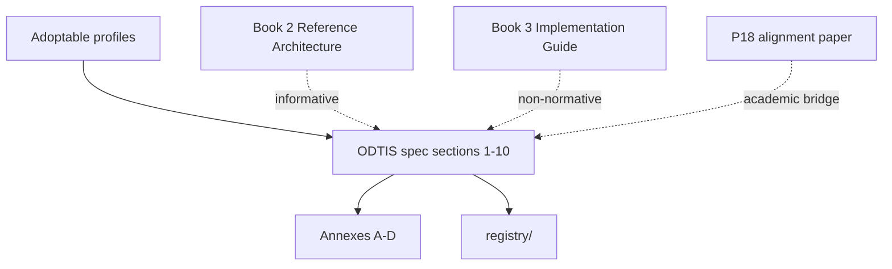

# ODTIS adoption guide

<div class="odtis-hub-hero" markdown="1">

Vendor-neutral open specification for interoperable Layer 1 identity, Layer 2 trust networks, operator federation, and optional extended modules.

<p class="odtis-hub-meta" markdown="1">
<strong>For:</strong> independent vendors, national operators, integrators, auditors, standards bodies | 
<strong>Version:</strong> <a href="/VERSION">0.9.0-draft</a> | 
<strong>License:</strong> <a href="/LICENSE">CC BY 4.0</a> | 
<strong>Project hub:</strong> [Project hub](/project/)
</p>

</div>

!!! tip "15-minute path"
    New implementers: [Getting started](/site/GETTING-STARTED/) | Conformance: [Conformance overview](/conformance/)

You do **not** need VenID product code to implement ODTIS. This guide maps how to adopt, verify, certify, and contribute.

---

## 1. What ODTIS is (and is not)

| ODTIS is | ODTIS is not |
|----------|--------------|
| Normative MUST/SHOULD/MAY for DTI implementations | An IETF RFC or OpenID Final Specification (yet) |
| Adoptable via **conformance profiles** | A single monolithic product spec |
| Verifiable at **L1 / L2 / L3** levels | A self-asserted "compatible" label without tests |
| Machine-readable (registry, OpenAPI, events) | Locked to one codebase or jurisdiction |
| Citable open text (CC BY 4.0) | Operator marketing material |

**Problem scope:** digital trust infrastructure for citizens, relying parties, and institutional partners - registration, verification, consent, trust-network exchange, operator PKI and audit, deployment phases.

---

## 2. Document stack (normative hierarchy)



| Layer | Location | Role for adopters |
|-------|----------|-------------------|
| **Normative** | [Specification sections](/spec/INDEX/) sections 1-10 | MUST/SHOULD/MAY - conformance source of truth |
| **Profiles** | [Conformance profiles](/spec/profiles/) | What to implement per product class |
| **Registry** | [Registry](/registry/) | 149 requirement IDs, events, terminology |
| **Annex A** | [Annex A OpenAPI registry](/annexes/A-openapi-registry/) | **Frozen** OpenAPI @ `0.9.0-draft` |
| **Annexes B-D** | [Annexes](/annexes/) | Threats, standards mapping, extended catalog |
| **Book 2** | [digitaltrustinfrastructure.org](https://digitaltrustinfrastructure.org) (Vol. II, informative) | Informative architecture (must not contradict ODTIS MUST) |
| **Book 3** | External implementation guide (informative) | Deployment patterns (non-normative) |
| **Reference impl** | [Reference implementations](/implementation/) | VenID `ven-*` map - **informative only** |

See spec section 1.12 and [Book 2 cross-review](/governance/BOOK2-CROSS-REVIEW/).

---

## 3. Adoptable profiles

Declare one or more profiles in your [Conformance statement template](/conformance/templates/conformance-statement.yaml).

Full comparison table, dependency graph, and coverage metrics: **[Profile comparison](/site/PROFILES/)**.

**Typical path:** Reference Architecture (required) -> Core Identity -> Trust Network -> Operator; add Federation for bilateral operator trust; add Extended sub-modules from Annex D when needed.

**External bindings:** Core Identity uses OIDC/OAuth/PKCE per [OIDF positioning](/governance/liaison/OIDF-POSITIONING/). ODTIS Federation is **not** OpenID Federation.

---

## 4. Implementation path (independent vendor)

### Step 1 - Read normative scope

1. [Section 1 - Scope and conformance](/spec/01-scope-conformance/SPEC/) - profiles, levels, claims
2. Your profile doc under [Conformance profiles](/spec/profiles/)
3. Mandatory sections listed in [Profile definitions](/registry/profiles.yaml)

### Step 2 - Bind machine-readable contracts

| Need | Artifact |
|------|----------|
| REST / OpenAPI | [Annex A OpenAPI registry](/annexes/A-openapi-registry/) (checksums in `CHECKSUMS.sha256`) |
| Requirement IDs | [Requirements registry](/registry/requirements.json) |
| Events | [Audit event catalog](/registry/events.yaml) + [Event JSON schemas](/registry/events/schemas/) |
| Standards alignment | [Annex C standards mapping](/annexes/C-standards-mapping/) |

Download index: [Machine-readable artifacts](/site/DOWNLOADS/#machine-readable-artifacts).

### Step 3 - Build against reference architecture (informative)

Use Book 2 chapters as **design context**, not conformance authority. Cross-review matrix: [Book 2 cross-review](/governance/BOOK2-CROSS-REVIEW/).

VenID reference code (optional): [RI surface map](/implementation/RI-MAP.yaml). A **second independent implementation** is required before ODTIS 1.0 production claims.

### Step 4 - Verify

```bash
# from repository root
./conformance/run.sh # L1 structural PASS
python3 scripts/run-conformance.py --level L2 # L2 structural (no live target)
ODTIS_TARGET=https://your-idp/realm ./conformance/sandbox/run-sandbox-check.sh
```

Execute manual procedures in [Conformance test procedures](/conformance/tests/) and record evidence.

---

## 5. Certification and conformance claims

| Level | Who runs it | What it proves today | Public claim |
|-------|-------------|----------------------|--------------|
| **L1** Laboratory | You | Repo + annex integrity; test stubs exist | "L1 PASS @ ODTIS version" |
| **L2** Staging | You + published evidence | L1 + live OIDC checks + manual stub execution | `conformance-statement.yaml` + JSON report |
| **L3** Production | **Third-party auditor** | L2 + independent attestation | **ODTIS Certified** mark (Phase 4 program) |

| Document | Purpose |
|----------|---------|
| [Certification program](/governance/CERTIFICATION/) | Program rules |
| [Self-certification guide](/conformance/certification/self-cert-guide/) | L2 self-cert steps |
| [Auditor guide](/conformance/certification/auditor-guide/) | L3 auditor scope (draft) |
| [Certification program (YAML)](/conformance/certification/program.yaml) | Machine-readable program |
| [Trademark policy](/governance/TRADEMARK-POLICY/) | Mark usage |

**Prohibited:** claiming "ODTIS certified" or production-ready without L3 program approval (spec 1.9.3).

---

## 6. IETF and protocol extraction track

ODTIS keeps **profile binding** in-repo; scoped protocol pieces may become IETF documents.

| Candidate I-D | ODTIS source | Status |
|---------------|--------------|--------|
| Trust Exchange Protocol (TEP) | section 4, gateway OpenAPI | [TEP draft](/ietf/drafts/draft-odtis-tep-00/) |
| Verification API HTTP profile | section 3.5, Annex A S2 | [Verify API draft](/ietf/drafts/draft-odtis-verify-api-00/) |
| Event envelope | section 9, JSON Schemas | [Events draft](/ietf/drafts/draft-odtis-events-00/) |
| Bilateral federation | section 6 | [Federation protocol draft](/ietf/drafts/draft-odtis-federation-00/) |

Roadmap: [IETF roadmap](/governance/IETF-ROADMAP/). Scoping (what **not** to duplicate): [IETF scoping](/governance/liaison/IETF-SCOPING/).

**Core Identity OIDC behavior stays on OIDC/OAuth RFCs** - ODTIS profiles and binds them; it does not replace them.

---

## 7. Open-spec habits (checklist)

| Habit | ODTIS artifact | Status @ 0.9.0-draft |
|-------|----------------|----------------------|
| Stable citation | [How to cite](/publication/HOW-TO-CITE/), `CITATION.cff` | DOI pending Zenodo |
| Semver + changelog | [VERSION](/VERSION), [Changelog](/CHANGELOG/) | Active draft |
| IPR / license | [LICENSE](/site/LICENSE/), [IPR policy](/governance/IPR-POLICY/) | CC BY 4.0 |
| Errata | [Errata policy](/governance/ERRATA/) | Process ready |
| Lifecycle stages | [Spec lifecycle stages](/governance/SPEC-STAGES/) | Review draft |
| Public review | [External review cycle 1](/governance/REVIEW-CYCLE-1/) | Cycle 1 open |
| Normative change RFC | [RFC template](/governance/RFC-TEMPLATE/) | Active |
| Conformance levels | spec 1.8, [Conformance](/conformance/) | L1+L2 operational |
| Machine-readable | [Registry](/registry/), Annex A, event schemas | In repo |
| Public spec site | [digitaltrustinfrastructure.org](https://digitaltrustinfrastructure.org) | Live; maintained via local deploy scripts |
| Foundation governance | [Foundation charter](/governance/FOUNDATION-CHARTER/) | Pre-incorporation |

---

## 8. Current maturity (honest)

**Ready for:** pilot / sandbox Core Identity + Trust Network implementations; L1 structural validation; L2 self-cert with manual evidence; academic and operator review.

**Not yet ready for:** production L3 third-party certification; DOI-stable `1.0.0`; Federation-heavy interop without RFC FB-002 resolution; Extended profile registry merge.

**Phase exit:** [Build plan](/PLAN-PHASES/) Phase 4 -> ODTIS `1.0.0`.

---

## 9. Contribute and influence the standard

| Action | Path |
|--------|------|
| Clarification / editorial | [Feedback channels](/governance/FEEDBACK/), GitHub issue templates |
| Normative change | [RFC template](/governance/RFC-TEMPLATE/) |
| Sandbox conformance report | [Sandbox alignment](/conformance/sandbox/) |
| Join as maintainer / WG | [Maintainers](/governance/MAINTAINERS/), [Working groups](/governance/working-groups/) |
| Hackathons & institutions | [Collaborate](/site/COLLABORATE/) | [Newsletter](/site/NEWSLETTER/) |

---

## 10. Quick links

<div class="odtis-hub-footer" markdown="1">

| Goal | Document |
|------|----------|
| Repository map | [Repository map](STRUCTURE.md) |
| Spec index | [Specification index](/spec/INDEX/) |
| Run validators | [Conformance overview](/conformance/) |
| Cite ODTIS | [How to cite](/publication/HOW-TO-CITE/) |
| Build plan | [Build plan](/PLAN-PHASES/) |
| Still stuck? | [FAQ](/site/FAQ/) |

</div>
