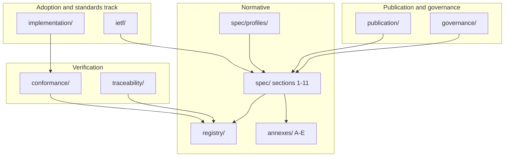

# ODTIS repository map

**Specification version:** [VERSION](/VERSION) (`0.9.0-draft`) 
**License:** [CC BY 4.0](/site/LICENSE/)

**Project hub:** [Project hub](/project/) | **Adoption:** [Adoption guide](/ADOPTION/)

This document is the **navigation hub** for the ODTIS tree. Normative MUST/SHOULD text lives in [Section 1 - Scope and conformance](/spec/01-scope-conformance/SPEC/); everything else supports publication, conformance, governance, or adoption.

---

## Document hierarchy



| Layer | Directory | Role |
|-------|-----------|------|
| **1. Normative prose** | [Specification sections](/spec/INDEX/) | Sections 1-11 (MUST/SHOULD/MAY) |
| **1b. Adoptable profiles** | [Conformance profiles](/spec/profiles/) | Core Identity, Trust Network, Reliance Extensions, ... |
| **2. Machine-readable** | [Registry](/registry/) | 204 requirement IDs, profiles, events |
| **3. Annexes** | [Annexes](/annexes/) | OpenAPI (A), threats (B), standards (C), extended (D), reliance (E) |
| **4. Conformance** | [Conformance](/conformance/) | L1/L2 tests, certification program |
| **5. Traceability** | [Traceability artifacts](https://github.com/odtis/core-spec/tree/main/traceability) | RF ↔ ODTIS automation |
| **6. Publication** | [Publication](/publication/HOW-TO-CITE/) | Citation, Zenodo releases |
| **7. Governance** | [Governance](/governance/) | Stages, IPR, review, RFC, liaison |
| **8. RI & gaps** | [Reference implementations](/implementation/) | Product map (`ven-*`) |
| **9. IETF track** | [Ietf](/ietf/) | Scoped Internet-Drafts (TEP, ...) |
| **10. Site** | [Site](/site/GETTING-STARTED/) | MkDocs -> `build/odtis-spec-site/` |
| **11. Automation** | [Scripts](https://github.com/odtis/core-spec/blob/main/tree/main/scripts) | Validate, sync version, release tarball |

---

## Start here

| Goal | Path |
|------|------|
| Project overview (site) | [Project hub](/project/) |
| Adopt ODTIS (vendor / operator) | [Adoption guide](/ADOPTION/) |
| Read the spec | [Specification index](/spec/INDEX/) -> section 1 |
| Implement Core Identity | [Core Identity profile](/spec/profiles/core-identity-profile/) + Annex A S2/S3 |
| Run validators | [Run script](/conformance/run.sh) |
| Cite ODTIS | [How to cite](/publication/HOW-TO-CITE/) |
| Contribute / RFC | [Contributing guide](/governance/CONTRIBUTING/) |
| Build plan | [Build plan](/PLAN-PHASES/) |

---

## Version discipline

Single source: [VERSION](/VERSION). After edits:

```bash
python3 scripts/sync-spec-version.py
python3 scripts/normalize-coherence.py
python3 scripts/sync-spec-version.py --check
```

---

## Outside this tree (informative)

| Source | Role |
|--------|------|
| [odtis.org](https://odtis.org) | ODTIS specification site (built from this repo) |
| [digitaltrustinfrastructure.org](https://digitaltrustinfrastructure.org) | Parent research org: Books, papers, academic track (not vendored here) |
| [core-impl](https://github.com/odtis/core-impl) | VenID reference implementation (`ven-*` modules) |

---

## Related

- [Project hub](/project/) - site project overview
- [Spec lifecycle stages](/governance/SPEC-STAGES/) - draft -> standard lifecycle
