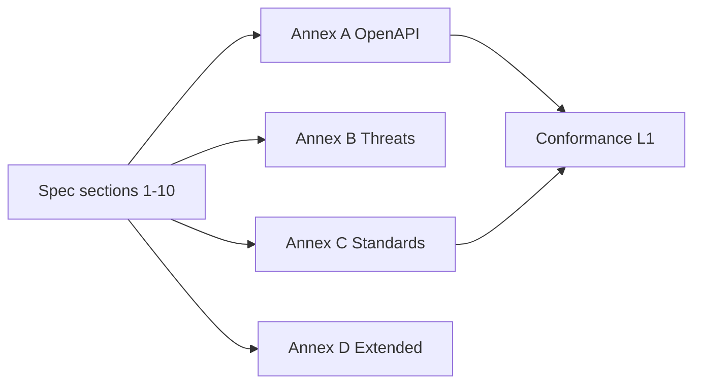

# ODTIS Annexes

<div class="odtis-hub-hero" markdown="1">

Machine-readable and reference annexes supporting normative sections 1-10.

<p class="odtis-hub-meta" markdown="1">
<strong>Version:</strong> <a href="/VERSION">0.9.0-draft</a> | 
<strong>Spec index:</strong> [Specification index](../spec/INDEX.md) | 
<strong>Project hub:</strong> [Project hub](../project/README.md)
</p>

</div>

!!! warning "Review draft annexes"
    Only **Annex A** is frozen @ `0.9.0-draft`. Annexes B-D remain review draft. See [Annex review matrix](../governance/ANNEX-REVIEW.md).

---

## At a glance

| Annex | Title | Status | Phase |
|-------|-------|--------|-------|
| [A](A-openapi-registry/README.md) | OpenAPI registry | **frozen** - see [Annex A freeze record](A-openapi-registry/FREEZE.md) | 3.2 ✅ |
| [B](B-threat-mitigations/README.md) | Threat mitigations | review draft (18 rows) | 3.2 ✅ |
| [C](C-standards-mapping/README.md) | Standards mapping | review draft (**149/149** IDs) | 3.2 ✅ |
| [D](D-extended-profiles/README.md) | Extended profiles | review draft (6 modules) | 3.2 ✅ |

Annexes **A** and **C** are required for implementers claiming **Core Identity** or **Trust Network** profiles.

---

## Choose your path

| You need... | Start here | Outcome |
|-------------|------------|---------|
| **REST/OpenAPI bindings** | [Annex A](A-openapi-registry/README.md) | Frozen S2-S8 bundles + OIDC discovery notes |
| **Security threat traceability** | [Annex B](B-threat-mitigations/README.md) | Threat -> ODTIS control mapping |
| **Standards crosswalk (EUDI, NIST, X-Road)** | [Annex C](C-standards-mapping/README.md) | Informative `mapping.yaml` |
| **Optional Extended modules** | [Annex D](D-extended-profiles/README.md) | E-Wallet, webhooks, KYB catalog |
| **Validate annex integrity** | Commands below | L1 PASS in CI |



---

## Site map (this section)

### Annex A - OpenAPI registry

| Page | Purpose |
|------|---------|
| [Overview](A-openapi-registry/README.md) | Surface catalog S1-S8 |
| [Freeze record](A-openapi-registry/FREEZE.md) | Checksums @ `0.9.0-draft` |
| [OIDC discovery](A-openapi-registry/oidc-discovery.md) | S1 informative contract |

### Annex B - Threat mitigations

| Page | Purpose |
|------|---------|
| [Overview](B-threat-mitigations/README.md) | `threats.yaml` index |
| [Red team scenarios](B-threat-mitigations/red-team-scenarios.md) | Operator exercise appendix |

### Annex C and D

| Page | Purpose |
|------|---------|
| [Standards mapping](C-standards-mapping/README.md) | 149/149 ID crosswalk |
| [Extended profiles](D-extended-profiles/README.md) | Sub-module catalog |

---

## Quick commands

```bash
# from repository root
# Annex validators (part of L1)
python3 scripts/validate-openapi.py
python3 scripts/validate-threats.py
python3 scripts/validate-standards-mapping.py
python3 scripts/validate-extended-annex.py

# Full L1 gate
./conformance/run.sh
```

---

## Related tabs

| Tab | When to use |
|-----|-------------|
| [Specification](../spec/INDEX.md) | Normative MUST/SHOULD prose |
| [Conformance](../conformance/README.md) | L1/L2/L3 verification |
| [Project](../project/README.md) | Status, governance, downloads |

---

<div class="odtis-hub-footer" markdown="1">

## Still stuck?

| Goal | Document |
|------|----------|
| Which annex applies to my profile? | [Profile comparison](../site/PROFILES.md) |
| Annex review matrix | [Annex review matrix](../governance/ANNEX-REVIEW.md) |
| Machine-readable artifact paths | [Machine-readable artifacts](../site/DOWNLOADS.md#machine-readable-artifacts) |
| Report a spec issue | [Feedback channels](../governance/FEEDBACK.md) |

</div>
