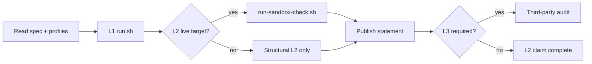

# ODTIS conformance

<div class="odtis-hub-hero" markdown="1">

Prove that your deployment meets ODTIS **MUST** requirements at the level your claim requires: repository integrity (L1), live staging behaviour (L2), or third-party production attestation (L3).

<p class="odtis-hub-meta" markdown="1">
<strong>Suite version:</strong> <a href="/VERSION">0.9.0-draft</a> | 
<strong>Project hub:</strong> [Project hub](../project/README.md) | 
<strong>Adoption:</strong> [Adoption guide](../ADOPTION.md)
</p>

</div>

!!! warning "Review draft - honest claims only"
    L1/L2 self-checks are available today. The **ODTIS Certified** mark requires L3 third-party attestation per [Trademark policy](../governance/TRADEMARK-POLICY.md). Do not imply production certification without published evidence.

---

## At a glance

| Item | Status |
|------|--------|
| **Conformance levels** | L1 (lab) | L2 (staging) | L3 (production audit) |
| **Profiles** | 6 adoptable profiles + Extended sub-modules |
| **Registry requirements** | 149 ODTIS IDs with linked test stubs |
| **Test procedures** | 159 procedures | **85 implemented** (smoke/L2 evidence) |
| **L1 structural gate** | PASS ([Run script](run.sh)) |
| **L2 runner** | Integrated; live `--target` optional |
| **L3 program** | Draft; VenID Phase 4 package available |

Live metrics: [Project status](../site/STATUS.md) | profile comparison: [Profile comparison](../site/PROFILES.md)

---

## Choose your path

| You are... | Start here | Typical outcome |
|------------|------------|-----------------|
| **New implementer** | [Getting started](../site/GETTING-STARTED.md) | Pick profiles, read spec, run L1 |
| **Stuck on conformance** | [FAQ](FAQ.md) | Levels, statements, common failures |
| **Vendor self-certifying (L2)** | [Self-certification guide](certification/self-cert-guide.md) | Published `conformance-statement.yaml` + L2 report |
| **Operator with a sandbox** | [Sandbox alignment](sandbox/README.md) | Live checks against `ODTIS_TARGET` |
| **Independent auditor (L3)** | [Auditor guide](certification/auditor-guide.md) | Attestation letter + findings register |
| **Reviewing VenID reference stack** | [L3 certification package](../implementation/L3-CERTIFICATION-PACKAGE.md) | Phase 4 statement + reproducible package |



Normative rules for claims: [Section 1 - Scope and conformance](../spec/01-scope-conformance/SPEC.md) (section 1.9).

---

## Conformance levels

| Level | Label | Who runs it | What it proves | Site guide |
|-------|-------|-------------|----------------|------------|
| **L1** | Laboratory | You (CI or local) | Spec repo integrity, manifests, Annex validators | This page (Quick start) |
| **L2** | Staging | You + published evidence | Behaviour against a live deployment URL | [Self-cert](certification/self-cert-guide.md) | [Sandbox](sandbox/README.md) |
| **L3** | Production | Third-party auditor | Operational maturity for production claims | [Auditor guide](certification/auditor-guide.md) | [Program](../governance/CERTIFICATION.md) |

**Key distinction:** L1 does not need a running IdP. L2 needs a reachable `--target` (realm URL for Core Identity). L3 needs manual test execution with signed lab notes plus automated L2 PASS.

---

## Quick start

### L1 - always run first

```bash
cd core-spec

# CI lab gate (no live target)
./conformance/run-l1-lab.sh

# Full structural suite (section completeness, Annex C, registry links)
./conformance/run.sh
```

### L2 - against your deployment

```bash
export ODTIS_TARGET=https://your-idp/realms/your-realm
./conformance/sandbox/run-sandbox-check.sh

# Or profile-scoped:
python3 scripts/run-conformance.py --level L2 --target "$ODTIS_TARGET" --profile core-identity
```

### Publish a claim

1. Copy [Conformance statement template](templates/conformance-statement.yaml).
2. Declare profiles, deployment phase (1-4), and environment honestly.
3. Attach L2 JSON from `conformance/reports/`.
4. Follow [Self-certification guide](certification/self-cert-guide.md).

### VenID reference stack (Phase 4)

```bash
./conformance/run-phase4-package.sh
```

See [L3 certification package](../implementation/L3-CERTIFICATION-PACKAGE.md) for artefacts and auditor workflow.

---

## Profile coverage

Regenerate: `python3 scripts/build-conformance-manifest.py` | sync status: `python3 scripts/sync-test-status-from-smokes.py`

| Profile | Procedures | Implemented (smoke) | Registry reqs | Profile doc |
|---------|------------|---------------------|---------------|-------------|
| Reference Architecture | 10 | 1 | 10 | [Profile](/spec/profiles/reference-architecture-profile/) |
| Core Identity | 58 | 9 | 45 | [Profile](/spec/profiles/core-identity-profile/) |
| Trust Network | 30 | 18 | 27 | [Profile](/spec/profiles/trust-network-profile/) |
| Federation | 8 | 8 | 8 | [Profile](/spec/profiles/federation-profile/) |
| Operator | 30 | 25 | 36 | [Profile](/spec/profiles/operator-profile/) |
| Extended | 23 | 20 | 25 | [Profile](/spec/profiles/extended-profile/) |
| **Total** | **159** | **85** | **149** | [Compare profiles](../site/PROFILES.md) |

!!! tip "Stub coverage vs execution"
    Every registry MUST has a linked test **procedure**. `implemented` means smoke or L2 evidence exists in this repo. Pending procedures do **not** waive MUST requirements - mark `tests.status: partial` in your statement until you execute and record them.

---

## How the suite works

1. **Declare** profile(s) and deployment phase in `conformance-statement.yaml` ([`ODTIS-0008`](../spec/01-scope-conformance/SPEC.md)).
2. **L1** runs Annex/registry validators and checks every `conformance_test` path exists.
3. **Manifests** under [Conformance profiles](/spec/profiles/) list manual procedures linked to `ODTIS-MNNN` IDs (parsed from test markdown).
4. **L2** adds OIDC discovery, JWKS, PKCE, and profile smokes when `--target` is set.
5. **L3** adds third-party execution of manual stubs plus policy/architecture review.

Component-level traceability (VenID RI): [Component bindings](../site/COMPONENT-BINDINGS.md)

---

## Certification guides {#certification-guides}

| Goal | Document | Time |
|------|----------|------|
| Levels and trademark rules | [Certification program](../governance/CERTIFICATION.md) | 5 min |
| Publish L2 self-cert claim | [Self-certification guide](certification/self-cert-guide.md) | 30-60 min |
| Run live sandbox checks | [Sandbox alignment](sandbox/README.md) | varies |
| File sandbox experience | [L2 report template](sandbox/L2-REPORT-TEMPLATE.md) | 20 min |
| L3 production audit | [Auditor guide](certification/auditor-guide.md) + [L3 audit checklist](certification/L3-AUDIT-CHECKLIST.md) | days-weeks |
| VenID Phase 4 package | [L3 certification package](../implementation/L3-CERTIFICATION-PACKAGE.md) | 1-2 hours |

**Statement template:** [Conformance statement template](templates/conformance-statement.yaml) | validate: `python3 scripts/validate-conformance-statement.py <path>`

**Machine-readable program:** `conformance/certification/program.yaml` (repo only)

---

## Site map (this section)

Sidebar order matches the **Conformance** tab.

| Group | Page | Purpose |
|-------|------|---------|
| **Start** | [Getting started](../site/GETTING-STARTED.md) | 15-minute path for new implementers |
| **Start** | [FAQ](FAQ.md) | Conformance questions (L1/L2/L3, statements, failures) |
| **L1 and L2** | [Self-certification](certification/self-cert-guide.md) | L2 step-by-step |
| **L1 and L2** | [Sandbox](sandbox/README.md) | Live RI alignment and operator checklist |
| **L1 and L2** | [L2 report template](sandbox/L2-REPORT-TEMPLATE.md) | GitHub issue template for sandbox reports |
| **L3** | [Certification program](../governance/CERTIFICATION.md) | Levels, profiles, trademark rules |
| **L3** | [L3 auditor guide](certification/auditor-guide.md) | Scope and evidence types for auditors |
| **L3** | [L3 audit checklist](certification/L3-AUDIT-CHECKLIST.md) | Executable A-F checklist |
| **L3** | [L3 certification package](../implementation/L3-CERTIFICATION-PACKAGE.md) | VenID Phase 4 reproducible package |
| **L3** | [Example Phase 4 statement](../implementation/statements/venid-phase4-full/conformance-statement.md) | Full-mandate statement sample |

---

## Repository layout

```
conformance/
├── README.md <- you are here
├── run.sh <- L1 + L2 wrapper
├── run-l1-lab.sh <- local L1 gate
├── run-phase4-package.sh <- VenID Phase 4 full package
├── manifest.yaml <- generated profile index
├── l2/ <- staging runner (PKCE, JWKS, discovery)
├── sandbox/ <- RI notes + run-sandbox-check.sh
├── certification/ <- self-cert, auditor guides, program.yaml
├── templates/
│ └── conformance-statement.yaml
├── profiles/ <- per-profile manifests (repo only)
└── tests/ <- manual procedure stubs (.md, repo only)
```

Test procedure markdown is maintained in the repository; browse via profile manifests or [Requirements registry](../registry/requirements.json) `conformance_test` links.

---

## Related tabs

| Tab | When to use |
|-----|-------------|
| [Specification](../spec/INDEX.md) | Normative MUST/SHOULD (section 1.9 claims) |
| [Annexes](../annexes/README.md) | OpenAPI, threats, standards mapping |
| [Project](../project/README.md) | Status, governance, downloads |

---

<div class="odtis-hub-footer" markdown="1">

## Still stuck?

| Goal | Document |
|------|----------|
| Conformance FAQ | [FAQ](FAQ.md) |
| 15-minute implementer path | [Getting started](../site/GETTING-STARTED.md) |
| VenID RI gaps | [Known gaps](../implementation/gaps/KNOWN-GAPS.md) |
| Report a spec issue | [Feedback](../governance/FEEDBACK.md) |

</div>
