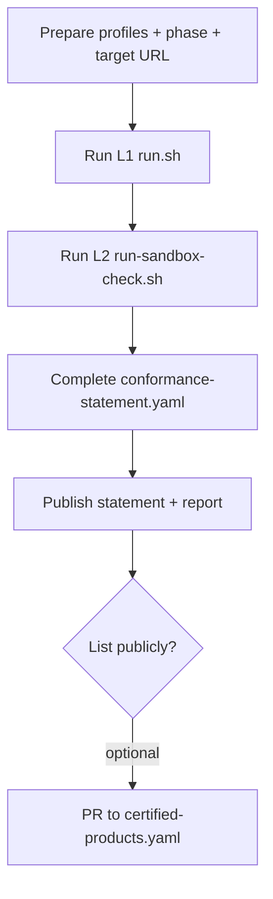

# ODTIS L2 self-certification guide

**Spec version:** [Version](../../VERSION) (`0.9.0-draft`) 
**Normative basis:** spec section 1.9 ([`ODTIS-0008`](../../spec/01-scope-conformance/SPEC.md), [`ODTIS-0534`](../../spec/01-scope-conformance/SPEC.md))

Self-certification lets you publish an **honest L2 staging claim**: your deployment was tested against ODTIS procedures with evidence attached. It is the standard path for vendors and operators before L3 production audit.

!!! info "Before you start"
    - You need **L1 PASS** from `./conformance/run.sh` (repository integrity).
    - For Core Identity L2 checks you need a reachable **IdP realm URL** (`ODTIS_TARGET`).
    - Your **deployment phase** (1-4) must match what you actually deploy ([Section 10 - Deployment](../../spec/10-deployment-profiles/SPEC.md)).

Hub: [Conformance overview](../README.md) | program rules: [Certification program](/governance/CERTIFICATION/)

---

## Overview



---

## 1. Prepare

| Field | What to decide |
|-------|----------------|
| **Profiles** | From [Profile definitions](/registry/profiles.yaml) - only declare what you implement |
| **Deployment phase** | 1=Core | 2=+Trust | 3=+Operator | 4=+Extended ([`ODTIS-0532`](../../spec/10-deployment-profiles/SPEC.md)) |
| **Environment** | `sandbox`, `staging`, or `production` - label honestly |
| **ODTIS version** | Pin exact semver (`0.9.0-draft` today) |
| **Target URL** | Realm base for Core Identity, e.g. `https://idp.example/realms/citizens` |

Profile selection help: [Profile comparison](/site/PROFILES/) | [Adoption guide](/ADOPTION/) section 3.

---

## 2. Run validators

```bash
# from repository root
# L1 - required
./conformance/run.sh

# L2 - live deployment
export ODTIS_TARGET=https://your-idp/realms/your-realm
./conformance/sandbox/run-sandbox-check.sh
```

Reports are written to `conformance/reports/l2-sandbox-*.json`. If the stack is down, L1 still passes; L2 live checks will FAIL - do not claim L2 PASS without a successful run.

**Profile-scoped L2:**

```bash
python3 scripts/run-conformance.py --level L2 --target "$ODTIS_TARGET" --profile core-identity --rebuild
```

Sandbox alignment details: [Sandbox alignment](../sandbox/README.md).

---

## 3. Complete conformance statement

Copy [Conformance statement template](../templates/conformance-statement.yaml) and fill required fields:

```yaml
odtis_version: "0.9.0-draft"
profiles:
  - reference-architecture
  - core-identity
level: L2
operator: "Your Organization"
environment: staging
jurisdiction: "VE"
deployment_phase: 1
tests:
 report_path: "conformance/reports/l2-sandbox-YYYYMMDD.json"
 status: partial # use pass only when manual stubs are executed
contact: "conformance@your-org.example"
date: "2026-06-12"
```

Validate before publishing:

```bash
python3 scripts/validate-conformance-statement.py path/to/conformance-statement.yaml
```

| `tests.status` | When to use |
|----------------|-------------|
| `partial` | L2 automated PASS but manual procedures not all executed |
| `pass` | All declared profile procedures executed with evidence |
| `fail` | Do not publish; fix implementation first |

Generate a human-readable companion (optional):

```bash
python3 scripts/generate-conformance-statement.py --help
```

---

## 4. Publish

Choose one or more channels:

| Channel | Action |
|---------|--------|
| **Operator policy site** | Host `conformance-statement.yaml` + L2 JSON |
| **GitHub issue** | Use [L2 report template](../sandbox/L2-REPORT-TEMPLATE.md) |
| **Review cycle** | Contribute feedback during [External review cycle 1](/governance/REVIEW-CYCLE-1/) |

Optional public listing (when program is operational): PR to [Certified Products (YAML)](certified-products.yaml).

---

## 5. What L2 does and does not prove

| L2 proves | L2 does not prove |
|-----------|-------------------|
| Automated checks against your `--target` | Third-party audit |
| You published a machine-readable statement | **ODTIS Certified** trademark use |
| Structural link to 159 test procedures | Every manual stub executed (unless you mark `pass`) |

**L3** requires independent attestation: [Auditor guide](auditor-guide.md) | [Certification program](/governance/CERTIFICATION/).

---

## 6. Common issues

| Symptom | Likely cause | Fix |
|---------|--------------|-----|
| L2 discovery FAIL | Wrong `ODTIS_TARGET` (not realm root) | Use realm URL ending in `/realms/name` |
| PKCE FAIL | IdP not enforcing S256 | Check Keycloak realm OIDC settings |
| Phase validation FAIL | Phase 4 profiles at phase 1 | Match statement to [Section 10 - Deployment](../../spec/10-deployment-profiles/SPEC.md) |
| `partial` stuck | Manual stubs not run | Execute procedures under `conformance/tests/<profile>/` |

---

## Related

- [Conformance hub](../README.md)
- [Certification program](/governance/CERTIFICATION/)
- [Sandbox alignment](../sandbox/README.md)
- [Trademark policy](/governance/TRADEMARK-POLICY/)
- VenID example (Phase 1): [Venid Phase1 Core](/implementation/statements/venid-phase1-core/)
