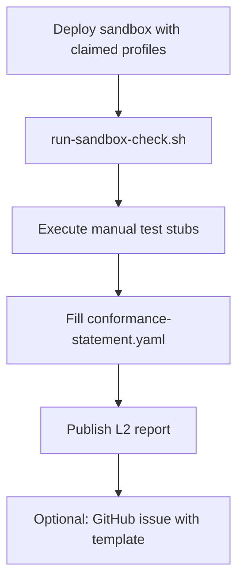

# ODTIS sandbox reference implementation alignment

**Status:** alignment map for live L2 checks 
**Audience:** operators running a sandbox or staging stack (VenID RI or independent)

This directory documents how a **live deployment** maps to ODTIS conformance profiles and automated checks. Runnable services live in product repos (`ven-identity-core`, `ven-trust-network`); this spec repo ships validators and procedure stubs.

!!! tip "When to use sandbox vs L1 only"
    - **L1 only** (`run.sh`): CI, spec contributors, no IdP required.
    - **Sandbox L2** (`run-sandbox-check.sh`): before publishing an L2 conformance statement.

Hub: [Conformance overview](../README.md) | self-cert: [Self-certification guide](../certification/self-cert-guide.md)

---

## Profile to sandbox scope

| ODTIS profile | Sandbox must expose | Typical phase |
|---------------|---------------------|---------------|
| **Reference Architecture** | Honest statement + layer rules | All |
| **Core Identity** | S1 OIDC, S2 verify, S3 citizen, S4 admin clients | 1 |
| **Trust Network** | Exchange gateway + partner mTLS (spec or live) | 2 |
| **Federation** | Bilateral config, route policies | 2+ |
| **Operator** | S5 admin, S8 regulator export, audit events | 3 |
| **Extended** | Declared Annex D sub-modules only | 4 |

Deployment **phase** (1-4) MUST match your conformance statement ([`ODTIS-0532`](../../spec/10-deployment-profiles/SPEC.md)).

Profile comparison: [Profile comparison](/site/PROFILES/)

---

## Quick start

```bash
# from repository root
# L1 only (no live stack)
./conformance/sandbox/run-sandbox-check.sh --l1-only

# L2 - live sandbox
export ODTIS_TARGET=http://localhost:8180/realms/identidad-digital
./conformance/sandbox/run-sandbox-check.sh
```

**VenID local defaults:**

| Service | Typical URL |
|---------|-------------|
| Keycloak realm | `http://localhost:8180/realms/identidad-digital` |
| Verification API | product repo smoke scripts |
| Exchange gateway | `ven-trust-network` smoke scripts |

---

## Conformance validation commands

```bash
# L1 lab (repository - CI gate, no live target)
./conformance/run-l1-lab.sh

# Full L2 package
export ODTIS_TARGET=http://localhost:8180/realms/identidad-digital
./conformance/sandbox/run-sandbox-check.sh

# OIDC smoke (PKCE, redirect_uri, logout discovery) - stack must be up
../core-impl/ven-identity-core/scripts/oidc-sandbox-check.sh

# Verification API smoke (client credentials, 401, optional subject verify)
../core-impl/ven-identity-core/scripts/verification-api-check.sh

# Step by step
python3 scripts/run-conformance.py --level L2 --target "$ODTIS_TARGET" --rebuild
python3 conformance/l2/run_l2.py --target "$ODTIS_TARGET" --output conformance/reports/l2-report.json
```

---

## L2 automated checks

| L2 check | Requirement | Evidence |
|----------|-------------|----------|
| OIDC discovery | ODTIS-0301 | HTTP 200 + JSON |
| Discovery fields | ODTIS-0301 | issuer, endpoints, grants, scopes |
| JWKS | ODTIS-0301 | `jwks_uri` returns `keys` |
| PKCE S256 | ODTIS-0302 | `code_challenge_methods_supported` |
| PKCE enforced | ODTIS-0302 | Auth without `code_challenge` rejected |
| Redirect URI | ODTIS-0305 | Unregistered `redirect_uri` rejected |
| Logout endpoint | ODTIS-0308 | `end_session_endpoint` |
| Revocation | ODTIS-0303 | `revocation_endpoint` |
| LoA schema | ODTIS-0316 | VerifyResponse `assurance_level` |
| Gateway mTLS spec | ODTIS-0204 | Annex A + live handshake (may be deferred) |
| Exchange gateway smoke | ODTIS-0201/0205 | `ven-trust-network/scripts/exchange-gateway-check.sh` |
| Service catalog smoke | ODTIS-0208/0222 | `ven-trust-network/scripts/service-catalog-check.sh` |
| Service grants smoke | ODTIS-0224/0226 | `ven-trust-network/scripts/service-grants-check.sh` |
| Sender multi-peer smoke | ODTIS-0223 | `ven-trust-network/scripts/sender-routing-check.sh` |

Manual stubs under `conformance/tests/` SHOULD be executed against sandbox and recorded in `conformance-statement.yaml`.

Live mTLS interop may remain deferred: [Deferred production track](/implementation/gaps/DEFERRED-TRACK/).

---

## Operator workflow



1. Deploy sandbox with claimed profiles and phase ([Section 10 - Deployment](../../spec/10-deployment-profiles/SPEC.md)).
2. Run `./conformance/sandbox/run-sandbox-check.sh "$ODTIS_TARGET"`.
3. Execute relevant manual stubs; record pass/fail.
4. Complete [Conformance statement template](../templates/conformance-statement.yaml).
5. File report using [L2 report template](L2-REPORT-TEMPLATE.md) (optional, review cycle).

---

## L2 report template (FB-005)

Operators filing sandbox experience use:

- [L2 report template](L2-REPORT-TEMPLATE.md) - copy into GitHub issue **ODTIS sandbox report**
- Steward baseline: [FB-005 sandbox template](/governance/review/sandbox-001-l2-report-template/)

Stewards triage during [External review cycle 1](/governance/REVIEW-CYCLE-1/).

---

## Sandbox checklist

- [ ] Publish OpenAPI URLs or ship Annex A bundles with deployment
- [ ] Fill [Conformance statement template](../templates/conformance-statement.yaml)
- [ ] Run L1 + L2; attach report to operator policy site
- [ ] Document phase (1-4) and profiles claimed honestly
- [ ] Label environment (`sandbox` vs `staging`)
- [ ] Record manual stub results before marking `tests.status: pass`

---

## Product code references (informative)

| Component | Typical repo / module |
|-----------|----------------------|
| identity-core, citizen-api | `ven-identity-core` |
| exchange gateway | `ven-trust-network` |
| Keycloak realm | operator deployment |

RI map: [RI surface map](/implementation/RI-MAP.yaml) | bindings: [Component bindings](/site/COMPONENT-BINDINGS/)

---

## Related

- [Conformance hub](../README.md)
- [Self-certification guide](../certification/self-cert-guide.md)
- Cross-review: [Book 2 cross-review](/governance/BOOK2-CROSS-REVIEW/)
- Book 3 (informative): external implementation guide (not vendored in this repository)
