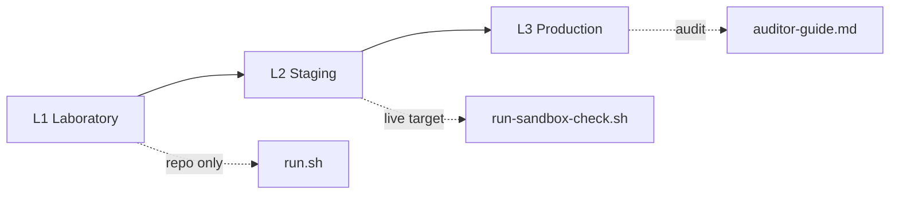

# ODTIS conformance certification

**Status:** draft program - operational details finalized in Phase 4.3 
**Suite version:** see [Version](/VERSION) (`0.9.0-draft`)

ODTIS defines three conformance levels. Each level answers a different question: *Is the spec repo coherent?* (L1) | *Does your deployment behave correctly?* (L2) | *Has an independent party verified production maturity?* (L3).

Hub: [Conformance overview](../conformance/README.md) | guides: [Certification guides](../conformance/README.md#certification-guides)

---

## Levels at a glance

| Level | Label | Who validates | What you publish | Typical use |
|-------|-------|---------------|------------------|-------------|
| **L1** | Laboratory | Self (CI/local) | Internal PASS log | Spec tracking, CI gate |
| **L2** | Staging | Self + public evidence | [Conformance statement template](../conformance/templates/conformance-statement.yaml) + L2 JSON | Vendor/partner claims, pilots |
| **L3** | Production | Third-party auditor or regulator | Attestation letter + L2 report + manual evidence | **ODTIS Certified** mark |

- **L1** proves spec repository integrity ([Run script](../conformance/run.sh)).
- **L2** proves behaviour against a live deployment URL.
- **L3** proves operational maturity for production claims.

---

## Profiles

Declare one or more profiles from [Profile definitions](../registry/profiles.yaml):

| Profile | Declare when |
|---------|--------------|
| `reference-architecture` | Always (layer/claim rules) |
| `core-identity` | Citizen IdP, verification API, consent |
| `trust-network` | Exchange gateway, service catalog |
| `federation` | Bilateral cross-operator trust |
| `operator` | PKI, audit, regulator export |
| `extended` | Annex D sub-modules (E-Wallet, E-KYB, ...) |

Claims **MUST** match deployment phase in [Section 10 - Deployment](../spec/10-deployment-profiles/SPEC.md). Comparison table: [Profile comparison](../site/PROFILES.md).

---

## Self-certification (L2)

**Guide:** [Self-certification guide](../conformance/certification/self-cert-guide.md)

| Step | Action |
|------|--------|
| 1 | Run L1: `./conformance/run.sh` |
| 2 | Run L2: `ODTIS_TARGET=<realm> ./conformance/sandbox/run-sandbox-check.sh` |
| 3 | Complete `conformance-statement.yaml` |
| 4 | Publish report (operator site or [L2 template](../conformance/sandbox/L2-REPORT-TEMPLATE.md)) |
| 5 | Optional: request listing in [Certified Products (YAML)](../conformance/certification/certified-products.yaml) |

!!! tip "Sandbox operators"
    See [Sandbox alignment](../conformance/sandbox/README.md) for VenID RI alignment and the operator checklist.

---

## Third-party attestation (L3)

**Guide:** [Auditor guide](../conformance/certification/auditor-guide.md) 
**Checklist:** [L3 audit checklist](../conformance/certification/L3-AUDIT-CHECKLIST.md)

| Step | Action |
|------|--------|
| 1 | Confirm operator L2 PASS and published `conformance-statement.yaml` |
| 2 | Verify deployment phase matches [Section 10 - Deployment](../spec/10-deployment-profiles/SPEC.md) |
| 3 | Execute manual procedures from [Test procedures hub](/conformance/tests/) with signed lab notes |
| 4 | Publish attestation letter + findings register |

| Document | Purpose |
|----------|---------|
| [Auditor guide](../conformance/certification/auditor-guide.md) | Scope and evidence types |
| [L3 audit checklist](../conformance/certification/L3-AUDIT-CHECKLIST.md) | Executable A-F checklist |
| [L3 certification package](../implementation/L3-CERTIFICATION-PACKAGE.md) | VenID Phase 4 reproducible package |
| [Deferred production track](../implementation/gaps/DEFERRED-TRACK.md) | Gaps that block unconditional L3 |

**VenID reference stack:** `./conformance/run-phase4-package.sh` generates the Phase 4 L3-target statement. Third-party attestation remains pending (`GAP-CERT-L3-ATT`).

---

## ODTIS Certified mark

Use of the **ODTIS Certified** mark requires compliance with [Trademark policy](TRADEMARK-POLICY.md) (draft).

| Allowed | Not allowed |
|---------|-------------|
| L2 statement: "ODTIS L2 staging conformance (self-certified)" | Implying third-party audit without L3 attestation |
| L3 statement with attached auditor letter | **ODTIS Certified** without program approval |
| Internal L1 tracking without public claim | False deployment phase claims |

Until the foundation program launches, self-certification statements **MUST NOT** imply third-party audit unless L3 attestation is attached.

---

## Related

- [Certification program (YAML)](../conformance/certification/program.yaml) - machine-readable program
- [Reference implementations overview](../implementation/README.md) - VenID reference map
- [Adoption guide](../ADOPTION.md) - full adoption path
- [Project status](../site/STATUS.md) - live conformance metrics
