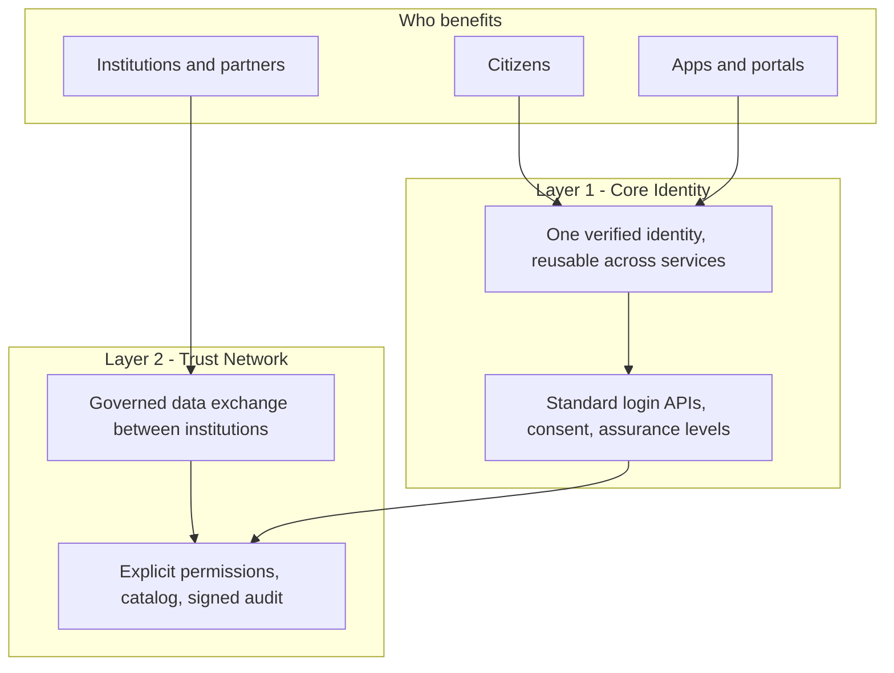

# Open specification for digital trust infrastructure

Adopt, implement, and certify interoperable identity and institutional exchange:
<strong>vendor-neutral</strong>, <strong>machine-readable</strong>, and <strong>testable at L1 / L2 / L3</strong>.

[Read the specification](/spec/INDEX/){ .md-button .md-button--primary .odtis-landing-cta--primary }
[Getting started (15 min)](/site/GETTING-STARTED/){ .md-button .odtis-landing-cta--secondary }

[Vision & mission](/site/ABOUT/) |
[Visual guide](/site/VISUAL-GUIDE/) |
[Collaborate](/site/COLLABORATE/) |
[Newsletter](/site/NEWSLETTER/) |
[Adoption guide](/ADOPTION/) |
[Conformance overview](/conformance/) |
[Downloads and artifacts](/site/DOWNLOADS/)

:material-account-key-outline:

<strong>Layer 1</strong>
OIDC + PKCE, Verification API, consent

:material-swap-horizontal:

<strong>Layer 2</strong>
mTLS gateway, catalog, signed audit

:material-clipboard-check-outline:

<strong>Conformance</strong>
6 profiles, Annex A, L1/L2/L3

<strong>149</strong>
Requirement IDs

<strong>6</strong>
Profiles

<strong>159</strong>
Test procedures

<!-- GENERATED:coverage-hero:START -->
<strong>100</strong>
Smoke-evidenced

<small class="odtis-stat__hint">62.9% of 159 procedures</small>
<!-- GENERATED:coverage-hero:END -->

<strong>10</strong>
Normative sections

<strong>7</strong>
Domains

About the project
## Vision & mission

A vendor-neutral open standard for verified identity and governed institutional exchange - testable, not self-asserted.

:material-telescope:
### Vision

Verified digital identity and governed institutional exchange across borders, vendors, and sectors - without locking citizens, governments, or businesses into a single proprietary stack.

<ul class="odtis-landing-vm-list">
<li><strong>Interoperable</strong> - shared conformance profiles and exchange semantics</li>
<li><strong>Accountable</strong> - PKI, consent, audit, and regulator-visible governance</li>
<li><strong>Adoptable</strong> - national law stays in adopter policy bindings</li>
<li><strong>Verifiable</strong> - L1 / L2 / L3 evidence, not marketing labels</li>
</ul>

:material-bullseye-arrow:
### Mission

Define normative MUST/SHOULD/MAY requirements so vendors, operators, integrators, and auditors share one testable contract for digital trust infrastructure.

<ol class="odtis-landing-vm-list odtis-landing-vm-list--ordered">
<li><strong>Standardize</strong> Layer 1 identity and Layer 2 trust networks</li>
<li><strong>Publish</strong> machine-readable registry, OpenAPI, and test procedures</li>
<li><strong>Enable</strong> phased adoption through conformance profiles</li>
<li><strong>Separate</strong> normative spec from reference code and national editions</li>
</ol>

[Full vision, mission, and ecosystem diagram](/site/ABOUT/) |
[Visual architecture guide](/site/VISUAL-GUIDE/)

Why ODTIS
## Built for independent adoption

Normative MUST/SHOULD/MAY per BCP 14, without binding to VenID product code.

:material-earth:
### Vendor-neutral

Declare conformance profiles and interoperate across operators, vendors, and jurisdictions without product lock-in.

:material-code-json:
### Machine-readable

Frozen Annex A OpenAPI, a requirements registry, and profile manifests for traceable implementation and audit.

:material-shield-check-outline:
### Testable claims

L1 structural validation, L2 sandbox smoke, and L3 third-party audit. Not self-asserted labels.

Start here
## Choose your path

:material-briefcase-outline:
### Policy / executive

Vision, two-layer model, and what ODTIS enables for governments and ecosystems - without implementation depth.

[About the project](/site/ABOUT/){ .md-button }

:material-domain:
### Independent vendor

Compare six profiles, download registries and manifests, and plan adoption without reference implementation code.

[Adoption guide](/ADOPTION/){ .md-button }

:material-bank-outline:
### National operator

Run Layer 1 and Layer 2 as platform operator: PKI, deployment phases, regulator export, and Operator profile duties.

[Operator profile](/spec/profiles/operator-profile/){ .md-button }

:material-wrench-outline:
### Implementer

Select profiles for your stack, bind [Annex A](/annexes/A-openapi-registry/), and run L1 structural checks before L2 sandbox smoke.

[Getting started](/site/GETTING-STARTED/){ .md-button }

:material-certificate-outline:
### Auditor / test lab

Review the L3 program, audit checklist, and evidence expectations for production conformance claims.

[Certification program](/governance/CERTIFICATION/){ .md-button }

:material-comment-eye-outline:
### External reviewer

Review cycle 1 is open until 2026-06-26 - submit clarifications, RFCs, and L2 sandbox reports.

[External review cycle 1](/governance/REVIEW-CYCLE-1/){ .md-button }

:material-handshake-outline:
### Institution / collaborator

Hackathons, pilot labs, and partnerships across research, implementation, and normative tracks.

[Collaborate](/site/COLLABORATE/){ .md-button }

:material-account-group-outline:
### Contributor

Open PRs, fix spec text, extend conformance tests, and follow governance and lifecycle stages.

[Contributing](/governance/CONTRIBUTING/){ .md-button }

:material-file-code-outline:
### Standards body

Track IETF working drafts, liaison positioning, and normative deltas relative to OIDC and OAuth.

[IETF working drafts](/ietf/){ .md-button }

:material-school-outline:
### Researcher

Cite ODTIS formally and trace requirement IDs back to the P18 evidence base.

[How to cite](/publication/HOW-TO-CITE/){ .md-button }

How it works
## Adopt in four steps

1
<h3>Declare profiles</h3>

Core Identity, Trust Network, Federation, Operator, or Extended.

2
<h3>Bind artifacts</h3>

[Annex A OpenAPI](/annexes/A-openapi-registry/) + [requirements registry](/registry/).

3
<h3>Verify</h3>

L1 structural, then L2 sandbox, then L3 audit for production.

4
<h3>Publish claim</h3>

[Conformance statement template](/conformance/certification/self-cert-guide/) with profile + level.

Architecture
## Two-layer model

Stop re-verifying people in every app, and stop wiring institutions one-by-one. ODTIS separates <strong>who someone is</strong> from <strong>who may exchange what</strong> - with standards underneath both.

One identity plane for people and apps. One trust plane for institutional exchange. Both are testable under ODTIS conformance profiles.

1

<strong>Core Identity</strong>
Citizens verify once; apps receive only consented attributes
<small class="odtis-landing-phase__tech">OIDC login, verification API, LoA</small>

2

<strong>Trust Network</strong>
Institutions exchange data with explicit permission and logs
<small class="odtis-landing-phase__tech">mTLS gateway, catalog, grants, audit</small>

2+

<strong>Federation</strong>
Operators trust each other bilaterally across borders
<small class="odtis-landing-phase__tech">Non-transitive operator agreements</small>

3

<strong>Operator</strong>
PKI, deployment phases, and regulator-visible governance
<small class="odtis-landing-phase__tech">Ceremonies, security baseline, export APIs</small>

[Engineer diagrams and request paths](/site/VISUAL-GUIDE/) |
[Vision and ecosystem view](/site/ABOUT/) |
[Profile comparison](/site/PROFILES/) |
[Full specification](/spec/INDEX/)

Documentation
## Explore the specification

Start with project context, then normative text, machine-readable annexes, and conformance verification.

:material-folder-information-outline:
### Project

Adoption guide, status, governance, reference implementation notes, and contribution workflows.

[Project hub](/project/){ .md-button }

:material-book-open-page-variant-outline:
### Specification

Ten normative sections, six profile packs, and the requirements registry with stable ODTIS-MNNN IDs.

[Specification index](/spec/INDEX/){ .md-button }

:material-file-document-multiple-outline:
### Annexes

Frozen OpenAPI (Annex A), threat models, standards crosswalk, and Extended sub-modules (Annex D).

[Annexes overview](/annexes/){ .md-button }

:material-shield-check-outline:
### Conformance

L1/L2/L3 levels, 159 test procedures, and smoke evidence for independent verification.

[Conformance overview](/conformance/){ .md-button }

## Ready to adopt ODTIS?

Pick a profile, bind Annex A, run L1, then publish your conformance claim.

[Adoption guide](/ADOPTION/){ .md-button .md-button--primary }
[Conformance overview](/conformance/){ .md-button }

