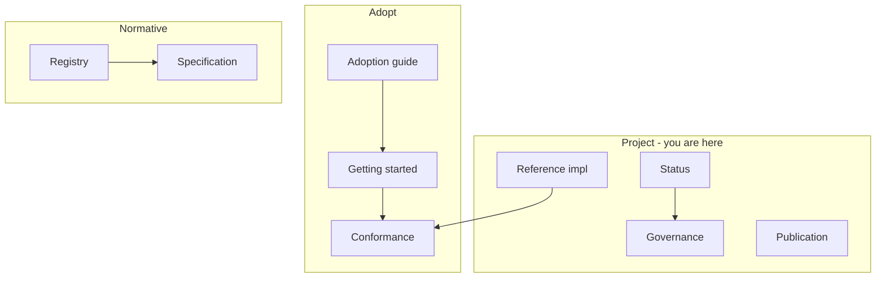

# ODTIS project

<div class="odtis-hub-hero" markdown="1">

Meta-information for adopters, contributors, and reviewers: **status**, **downloads**, **governance**, **reference implementation**, **IETF track**, and **publication**.

<p class="odtis-hub-meta" markdown="1">
<strong>Version:</strong> <a href="/VERSION">0.9.0-draft</a> | 
<strong>License:</strong> <a href="/LICENSE">CC BY 4.0</a>
</p>

</div>

!!! warning "Review draft"
    ODTIS is not `1.0.0` yet. See [Status](../site/STATUS.md) and [Spec lifecycle stages](../governance/SPEC-STAGES.md) before production or certification claims.

---

## At a glance

Live metrics, review-cycle dates, and maturity context: **[Project status](../site/STATUS.md)** (canonical) and **[Adoption guide](../ADOPTION.md)** section 8.

---

## Choose your path

| You are... | Start here | Outcome |
|------------|------------|---------|
| **New adopter** | [Adoption guide](../ADOPTION.md) | Profiles, artifacts, certification path |
| **Implementer (15 min)** | [Getting started](../site/GETTING-STARTED.md) | Spec + L1/L2 |
| **Looking for YAML/JSON** | [Downloads & artifacts](../site/DOWNLOADS.md#machine-readable-artifacts) | Clone, tarball, registries |
| **Contributor** | [Contributing](../governance/CONTRIBUTING.md) | PR workflow |
| **Reviewer (cycle 1)** | [External review](../governance/REVIEW-CYCLE-1.md) | Feedback by 2026-06-26 |
| **Citing ODTIS** | [How to cite](../publication/HOW-TO-CITE.md) | BibTeX / CFF |
| **VenID RI mapper** | [Reference implementations](../implementation/README.md) | RI-MAP, gaps, bindings |
| **Standards liaison** | [IETF drafts](../ietf/README.md) | Scoped protocol extraction |



---

## Site map (this section)

Sidebar order matches the **Project** tab in the site navigation.

### About the project

| Page | Purpose |
|------|---------|
| [About](../site/ABOUT.md) | Mission, scope, license |
| [The team](../site/TEAM.md) | Editors and working groups |
| [Contact](../site/CONTACT.md) | Feedback, collaboration, press |

### Adoption

| Page | Purpose |
|------|---------|
| [Adoption guide](../ADOPTION.md) | Full vendor/operator path |
| [Downloads & artifacts](../site/DOWNLOADS.md) | Clone, tarball, OpenAPI, registry |
| [Requirements registry](../registry/README.md) | IDs, profiles, events, terminology |
| [Status](../site/STATUS.md) | Maturity snapshot, coverage metrics, blockers |
| [FAQ](../site/FAQ.md) | Short answers (all audiences) |

Implementers: [Getting started](../site/GETTING-STARTED.md) (Conformance tab) | [Conformance overview](../conformance/README.md)

### Legal

| Page | Purpose |
|------|---------|
| [Privacy](../site/PRIVACY.md) | Site and community data practices |
| [Code of conduct](../site/CODE-OF-CONDUCT.md) | Community standards |
| [License](../site/LICENSE.md) | CC BY 4.0 and IPR summary |
| [Terms of use](../site/TERMS.md) | Website terms |

Community programs: [Collaborate](../site/COLLABORATE.md) | [Newsletter](../site/NEWSLETTER.md) | [Visual guide](../site/VISUAL-GUIDE.md) (top-level tabs)

**Annexes** (OpenAPI, threats, standards) are reachable from every page via the **site footer** link.

### Citation and releases

| Page | Purpose |
|------|---------|
| [How to cite](../publication/HOW-TO-CITE.md) | Citation strings |
| [Changelog](/CHANGELOG/) | Release history |
| [Zenodo release checklist](../publication/zenodo/RELEASE-CHECKLIST.md) | DOI snapshot process |

### Reference implementation

| Page | Purpose |
|------|---------|
| [RI overview](../implementation/README.md) | VenID reference implementation map |
| [Component bindings](../site/COMPONENT-BINDINGS.md) | VenID RI surface map |
| [Known gaps](../implementation/gaps/KNOWN-GAPS.md) | RI gap register |
| [Deferred production track](../implementation/gaps/DEFERRED-TRACK.md) | mTLS, TSA, L3 attestation |

### IETF, governance, and publication

| Page | Purpose |
|------|---------|
| [IETF working drafts](../ietf/README.md) | TEP, Verify API, events, federation |
| [Governance overview](../governance/README.md) | Process, policies, review, liaison |
| [Contributing](../governance/CONTRIBUTING.md) | PR workflow |
| [External review cycle 1](../governance/REVIEW-CYCLE-1.md) | Open feedback period |

Certification: [Conformance tab](../conformance/README.md) | [Certification program](../governance/CERTIFICATION.md)

### Repository meta

| Page | Purpose |
|------|---------|
| [Repository map](../STRUCTURE.md) | Directory navigation |
| [Build plan](../PLAN-PHASES.md) | Phase 3-4 deliverables |

Browse: [Glossary](../site/GLOSSARY.md) | [Requirements index](../site/REQUIREMENTS-INDEX.md) | [Profile comparison](../site/PROFILES.md) | [Book 1 domain map](../registry/BOOK1-DOMAINS.md)

---

## Quick commands

```bash
cd core-spec

# Project health
./conformance/run.sh
python3 scripts/validate-registry.py

# Build site locally
./scripts/build-site.sh
mkdocs serve -f site/mkdocs.yml

# Release tarball (maintainers)
./scripts/package-release.sh
```

---

## Related tabs

| Tab | When to use |
|-----|-------------|
| [Specification](../spec/INDEX.md) | Normative MUST/SHOULD prose |
| [Annexes](../annexes/README.md) | OpenAPI, threats, standards, Extended |
| [Conformance](../conformance/README.md) | L1/L2/L3 verification |

---

<div class="odtis-hub-footer" markdown="1">

## Still stuck?

| Goal | Document |
|------|----------|
| Conformance questions | [Conformance FAQ](../conformance/FAQ.md) |
| Repository layout | [Repository map](../STRUCTURE.md) |
| Trademark / certification | [Trademark policy](../governance/TRADEMARK-POLICY.md) |
| Report a spec issue | [Feedback channels](../governance/FEEDBACK.md) |

</div>
