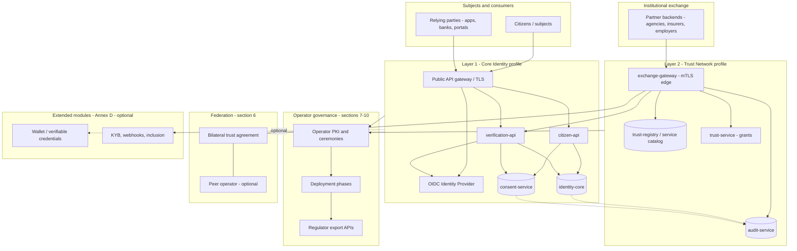
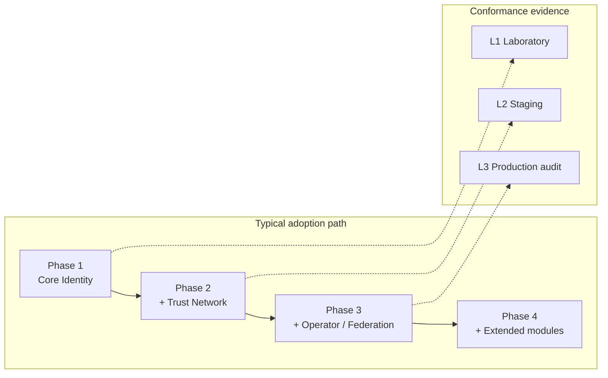

# About ODTIS

**Open Digital Trust Infrastructure Specification** - a vendor-neutral, testable open standard for digital identity and institutional trust exchange.

<strong>Version:</strong> <a href="/VERSION">0.9.0-draft</a> | 
<strong>License:</strong> <a href="https://creativecommons.org/licenses/by/4.0/">CC BY 4.0</a> | 
<strong>Copyright:</strong> FinnectOS, Inc. (CC BY 4.0) | 
<strong>Steward:</strong> FinnectOS, Inc. (interim) · <strong>VenID RI:</strong> <a href="https://github.com/odtis/core-impl">core-impl</a> · <strong>Research:</strong> <a href="https://digitaltrustinfrastructure.org">DTI</a>

---

## Vision

A world where **verified digital identity and governed institutional exchange** work across borders, vendors, and sectors - without locking citizens, governments, or businesses into a single proprietary stack.

ODTIS envisions digital trust infrastructure that is:

- **Interoperable** - multiple implementations can serve the same conformance profiles and exchange under shared semantics.
- **Accountable** - operators, partners, and relying parties act under PKI, consent, audit, and regulator-visible governance.
- **Adoptable** - national law, sector rules, and procurement stay in adopter policy bindings; the specification stays jurisdiction-agnostic.
- **Verifiable** - claims are backed by L1 / L2 / L3 conformance evidence, not marketing labels.

---

## Mission

ODTIS defines **normative MUST/SHOULD/MAY** requirements so that independent vendors, national operators, integrators, and auditors share one testable contract for digital trust infrastructure.

The mission is to:

1. **Standardize** Layer 1 identity (OIDC, verification, consent, Levels of Assurance) and Layer 2 trust networks (mTLS gateway, catalog, grants, signed audit).
2. **Publish** machine-readable artifacts (registry, OpenAPI, events, conformance procedures) that implementations can validate against.
3. **Enable** phased adoption through **conformance profiles** - implement only what your product class needs, then expand.
4. **Separate** normative specification from informative reference code, architecture monographs, and national policy editions.

Implementations declare **conformance profiles** and verify claims at **L1 / L2 / L3** - not self-asserted "compatible" labels.

---

## What ODTIS is for

Digital trust breaks when every institution builds its own silo: citizens re-verify identity for each app, partners negotiate bespoke APIs, and supervisors cannot see ecosystem health without bulk data copies.

ODTIS addresses that pattern with a **two-layer model**:

| Layer | Problem it solves | What adopters gain |
|-------|-------------------|-------------------|
| **Layer 1 - Core Identity** | Fragmented login and attribute release | One OIDC-based identity plane, server-side verification API, consent-gated attributes, LoA |
| **Layer 2 - Trust Network** | N-to-N institutional integration hell | mTLS exchange gateway, service catalog, explicit grants, fail-closed access, signed audit |
| **Operator governance** | Who runs PKI, phases, and accountability | Deployment phases, regulator export, bilateral federation semantics |
| **Extended (optional)** | Wallets, KYB, inclusion, webhooks | Annex D modules declared per implementation |

**Who benefits:**

- **Citizens** - verify once, control consent, revoke access where the profile requires it.
- **Relying parties** - standard OIDC and verification APIs instead of custom integrations per operator.
- **Partner institutions** - governed backend exchange with purpose limitation and traceable logs.
- **Operators and regulators** - PKI ceremonies, aggregated supervision, export surfaces without mandating one national law in the spec text.
- **Vendors** - a neutral conformance target; compete on implementation quality, not lock-in.

National legal transposition, QTSP certification, and procurement terms live in **adopter policy bindings** and Book 3 editions - see [Scope section 1.2.2](../spec/01-scope-conformance/SPEC.md).

---

## What ODTIS enables

At a high level, a conforming stack lets you:

- **Register and assert identity** for subjects with declared Levels of Assurance.
- **Authenticate citizens and clients** via OIDC with PKCE and scoped tokens.
- **Release attributes to relying parties** only when active consent and LoA rules pass (fail-closed).
- **Catalog trust-network services** and issue **grants** that bound who may call what, for which purpose, and for how long.
- **Exchange data between institutions** through an mTLS gateway that validates partner certificates and grants before forwarding.
- **Audit every sensitive path** - consent, verification, exchange - with correlation IDs suitable for operator and regulator review.
- **Federate bilaterally** between operators without transitive trust assumptions.
- **Declare optional modules** (wallet credentials, webhooks, KYB, inclusion) when Annex D applies.

Deeper request-path diagrams: [Visual architecture guide](VISUAL-GUIDE.md). Adoption paths: [Adoption guide](../ADOPTION.md).

---

## How it works at scale

The diagram below is an **ecosystem view**: logical ODTIS surfaces and actors, not a single deployment topology. One country may run one operator; another may federate several. Reference repos (`ven-identity-core`, `ven-trust-network`) are **informative** bindings of these surfaces.

**Scale properties:**

| Dimension | How ODTIS behaves |
|-----------|-------------------|
| **Horizontal - many RPs** | Same Layer 1 APIs and consent model; RPs register as OIDC clients with scoped access. |
| **Horizontal - many partners** | Layer 2 catalog plus grants; gateway enforces mTLS identity and purpose before proxying. |
| **Vertical - assurance** | LoA gates verification responses; higher-risk flows require stronger registration and MFA per profile. |
| **Geographic - operators** | Bilateral federation between operators; no universal transitive trust graph in the normative core. |
| **Vendor - implementations** | Any stack that passes declared profile tests; VenID RI is one informative example. |
| **Maturity - conformance** | L1 structural, L2 staging smoke, L3 independent production attestation. |

Profile detail and requirement counts: [Visual guide - profiles](VISUAL-GUIDE.md#conformance-profiles) | [Profile comparison](PROFILES.md).

---

## What ODTIS is not

See the full **is / is not** table and problem scope in the [Adoption guide](../ADOPTION.md) section 1.

---

## Relationship to VenID

| Artifact | Role |
|----------|------|
| **ODTIS** ([core-spec](https://github.com/odtis/core-spec)) | Normative source of truth |
| **VenID reference implementation** ([core-impl](https://github.com/odtis/core-impl)) | Informative RI - one conforming stack |
| **Book 2** | Informative architecture monograph |
| **Papers P01-P18** | Academic evidence and design rationale |

Independent vendors MAY implement ODTIS without VenID code. See [Adoption guide](../ADOPTION.md).

---

## Foundation (planned)

A multi-stakeholder **ODTIS Foundation** is planned (Phase C). Until incorporation, editors act per [Maintainers](../governance/MAINTAINERS.md) and [Foundation charter](../governance/FOUNDATION-CHARTER.md) (draft).

---

## Still stuck?

| Goal | Document |
|------|----------|
| Adoption path | [Adoption guide](../ADOPTION.md) |
| Architecture diagrams | [Visual architecture guide](VISUAL-GUIDE.md) |
| Project hub | [Project hub](../project/README.md) |
| How to cite | [How to cite](../publication/HOW-TO-CITE.md) |

