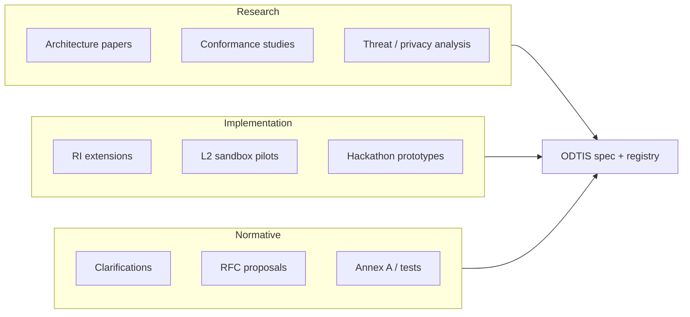

# Collaborate with ODTIS

Hackathons, pilot labs, and institutional partnerships across **research**, **reference implementation**, and **normative** work - without vendor lock-in.

<strong>Contact:</strong> <a href="mailto:info@odtis.org?subject=ODTIS%20collaboration%20proposal">info@odtis.org</a> | 
<strong>Feedback:</strong> [External review](../governance/FEEDBACK.md) | 
<strong>News:</strong> [Newsletter](NEWSLETTER.md) | 
<strong>Conduct:</strong> [Code of conduct](CODE-OF-CONDUCT.md)

!!! info "Open specification, many implementers"
    ODTIS is **vendor-neutral** (CC BY 4.0). Universities, public agencies, integrators, and startups can collaborate on the **same normative baseline** while keeping their own codebases and jurisdiction-specific policy bindings.

---

## Collaboration tracks

| Track | You contribute | ODTIS provides | Typical output |
|-------|----------------|----------------|----------------|
| **Research** | Studies, datasets (anonymized), comparative models | Stable IDs, profiles, citation path | Paper, Zenodo deposit, traceability to ODTIS-MNNN |
| **Implementation** | Adapter, gateway, IdP, or operator tooling | Annex A OpenAPI, L1/L2 tests, RI map | L2 report + `conformance-statement.yaml` |
| **Normative** | Review comments, RFC drafts, test procedures | Review cycle, RFC template, registry | Merged spec text, new conformance test |

---

## Who we partner with

:material-school-outline:
### Universities & labs

Graduate projects, reproducibility studies, security evaluations, and architecture courses using ODTIS as the normative baseline.

:material-domain:
### Public institutions

Pilot identity programs, trust-network nodes, regulator sandboxes, and policy binding statements per jurisdiction.

:material-code-braces:
### Integrators & vendors

Independent Core Identity or Trust Network stacks; L2 self-certification and optional certified-products listing.

:material-account-group-outline:
### Standards & industry bodies

Liaison on OIDC/OAuth deltas, IETF TEP track, GovStack DPI alignment - see [liaison docs](../governance/liaison/OIDF-POSITIONING.md).

---

## Hackathons & build sprints

ODTIS hackathons focus on **interoperable outcomes**, not throwaway demos.

### Suggested themes

| Theme | Duration | Goal |
|-------|----------|------|
| **Core Identity sprint** | 48-72 h | OIDC + PKCE + consent-gated Verification API against a fresh realm |
| **Trust Network sprint** | 48-72 h | Partner node + mTLS + grant + exchange audit event |
| **Conformance lab** | 1 week | Close L2 gaps for one profile; publish statement |
| **Privacy & DSAR** | 48 h | Citizen portal flows + operator DSAR runbook dry-run |
| **Extended module** | 1 week | Annex D sub-module (wallet, webhooks, KYB) with tests |

### What organizers get

| Asset | Location |
|-------|----------|
| Reproducible stack guide | Paper **P12** (VenID reference deployment) |
| L1 structural gate | `./conformance/run.sh` |
| L2 smoke target | `./conformance/sandbox/run-sandbox-check.sh` |
| Visual architecture | [Visual guide](VISUAL-GUIDE.md) |
| Scoring rubric (suggested) | L1 PASS + N live tests + published statement draft |

### Organizer checklist

1. Declare which **ODTIS profile(s)** teams must target.
2. Provide a shared **sandbox URL** (`ODTIS_TARGET`) or local Compose instructions.
3. Require teams to submit **`conformance-statement.yaml`** (even if partial).
4. Log normative gaps as **clarifications** or **RFCs** via [Feedback channels](../governance/FEEDBACK.md).

!!! tip "Co-branded events"
    Email stewards with institution name, dates, expected teams, and profiles in scope. We can link the event from the [Newsletter](NEWSLETTER.md) and provide a short ODTIS intro slot (remote).

---

## Active collaboration windows

| Window | Closes | Focus | How to join |
|--------|--------|-------|-------------|
| **Review cycle 1** | 2026-06-26 | Normative clarity, Annex A, L2 sandbox | [External review cycle 1](../governance/REVIEW-CYCLE-1.md) |
| **Working groups (planned)** | TBD | Connect, Trust Network, Operator, Extended | [Working groups](../governance/working-groups/README.md) |
| **L3 pilot attestation** | Phase 4 | Production operator audit | [L3 certification package](../implementation/L3-CERTIFICATION-PACKAGE.md) |

---

## Proposal template

Send a short note to **info@odtis.org** with:

1. **Institution** and contact
2. **Track** - research | implementation | normative (or combined)
3. **ODTIS profile(s)** in scope
4. **Timeline** and deliverables
5. **IP / publication** intent (open license preferred for normative contributions)

For normative changes, use the formal [RFC template](../governance/RFC-TEMPLATE.md) after initial alignment.

---

## Still stuck?

| Goal | Document |
|------|----------|
| Implementer path | [Getting started](GETTING-STARTED.md) |
| Contributor workflow | [Contributing](../governance/CONTRIBUTING.md) |
| Certification | [Certification program](../governance/CERTIFICATION.md) |
| Stay updated | [Newsletter](NEWSLETTER.md) |

