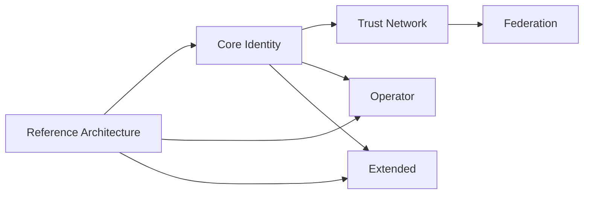

# ODTIS conformance profiles

Summary for implementers. Normative definitions: [Section 1 - Scope and conformance](../spec/01-scope-conformance/SPEC.md) section 1.6 and [Profile definitions](../registry/profiles.yaml).

<strong>Adoption:</strong> [Adoption guide](../ADOPTION.md) | 
<strong>Visual model:</strong> [Visual architecture guide](VISUAL-GUIDE.md)

---

## Dependency graph

---

## Comparison

| Profile | Domain | Sections | Depends on | Maturity @ 0.9.0-draft | Profile doc |
|---------|--------|----------|------------|------------------------|-------------|
| **Reference Architecture** | ODTIS-0000 | 1 | - | High | [reference-architecture](/spec/profiles/reference-architecture-profile/) |
| **Core Identity** | ODTIS-0001, 0003 | 2, 3, 5 | reference-architecture | High | [core-identity](/spec/profiles/core-identity-profile/) |
| **Trust Network** | ODTIS-0002 | 4 | core-identity | Medium | [trust-network](/spec/profiles/trust-network-profile/) |
| **Federation** | ODTIS-0004 | 6 | trust-network | Medium (8 IDs) | [federation](/spec/profiles/federation-profile/) |
| **Operator** | ODTIS-0005 | 7-10 | reference-architecture, core-identity | Medium | [operator](/spec/profiles/operator-profile/) |
| **Extended** | ODTIS-0003 | Annex D | reference-architecture, core-identity | Draft | [extended](/spec/profiles/extended-profile/) |

---

## External bindings

| Profile | Primary external standards |
|---------|---------------------------|
| Reference Architecture | VenID two-layer model (informative: Book 2 ch. 3) |
| Core Identity | OIDC Core, OAuth 2.0, PKCE (RFC 7636) |
| Trust Network | mTLS gateway, TEP (IETF track) |
| Federation | Bilateral agreements - **not** OpenID Federation |
| Operator | PKI, audit, deployment phases |
| Extended | OID4VP, webhooks, sector modules (Annex D) |

See [OIDF positioning](../governance/liaison/OIDF-POSITIONING.md).

---

## Conformance coverage (stub linkage)

<!-- GENERATED:profile-coverage:START -->

| Profile | Reqs | Tests | Implemented | Req coverage |
|---------|------|-------|-------------|--------------|
| Core Identity | 45 | 58 | 56 | 100.0% |
| Extended | 25 | 23 | 20 | 100.0% |
| Federation | 8 | 8 | 8 | 100.0% |
| Operator | 36 | 30 | 27 | 100.0% |
| Reference Architecture | 10 | 10 | 1 | 100.0% |
| Trust Network | 27 | 30 | 18 | 100.0% |

Totals (unique test files): **159** procedures, **130** with smoke `implemented` status.

<!-- GENERATED:profile-coverage:END -->

Regenerate: `python3 scripts/build-conformance-manifest.py`

---

## Choose a path

- **Any ODTIS claim** - Reference Architecture (required) + declared functional profiles
- **SaaS IdP vendor** - Reference Architecture + Core Identity (+ Operator if you run the platform)
- **National operator** - Reference Architecture + Core Identity + Trust Network + Operator
- **Cross-border exchange** - add Federation when bilateral agreements are active (FB-002 accepted)
- **Wallet / webhook module** - Extended sub-modules on Core Identity

[Getting started](GETTING-STARTED.md) | [Adoption guide](../ADOPTION.md)

---

## Still stuck?

| Goal | Document |
|------|----------|
| Normative profile docs | [Specification profiles](/spec/profiles/) |
| Conformance path | [Conformance overview](../conformance/README.md) |
| Visual dependency graph | [Visual architecture guide](VISUAL-GUIDE.md) |

