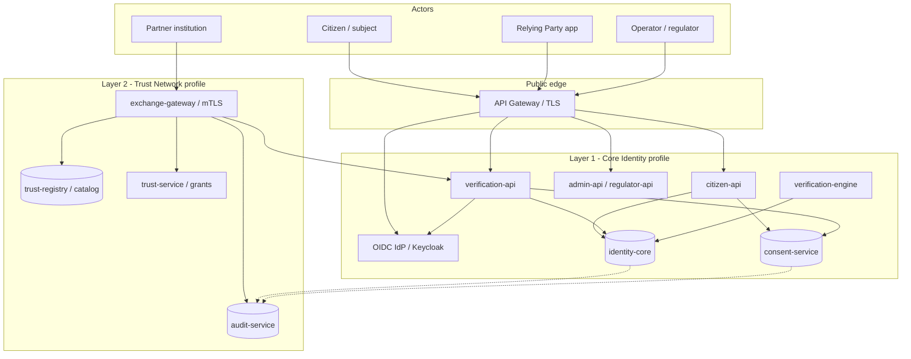
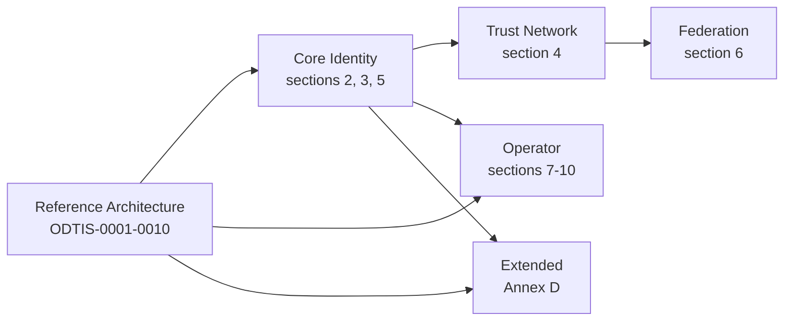
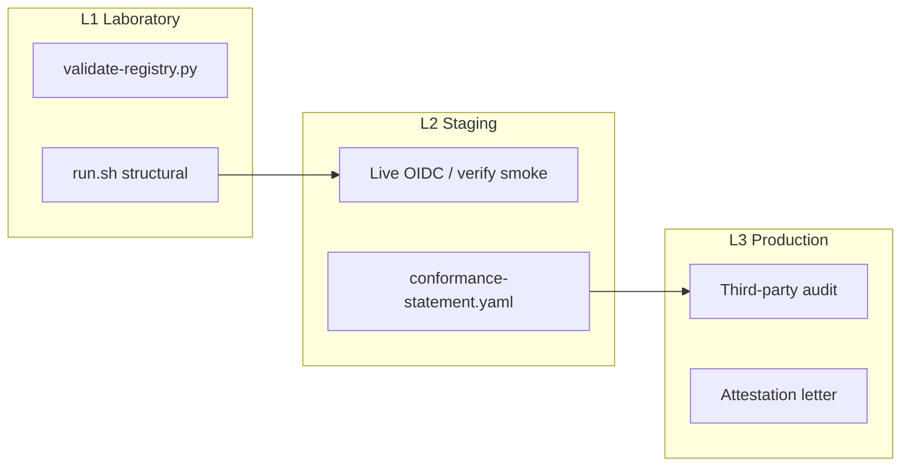
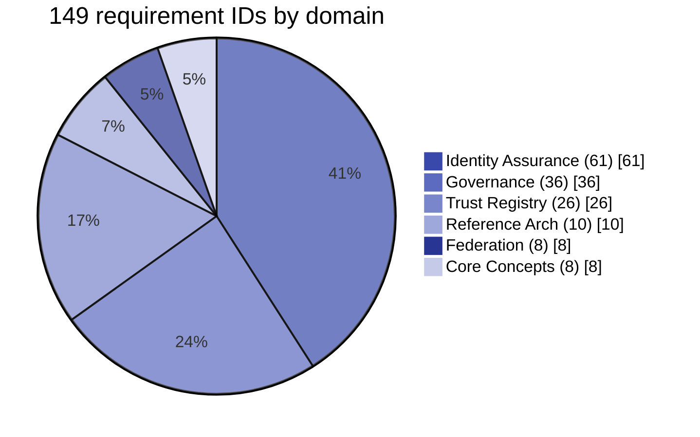
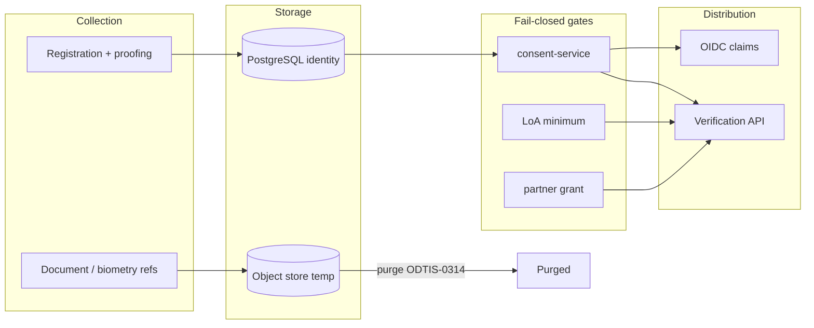

<div class="odtis-hub-hero" markdown="1">

# Visual architecture guide

Engineer-oriented diagrams for the ODTIS two-layer model, request paths, profiles, and conformance levels.

<p class="odtis-hub-meta" markdown="1">
<strong>Normative text:</strong> [Specification](../spec/INDEX.md) | 
<strong>Informative figures:</strong> Paper P01 PlantUML figures are published with the academic track (see [digitaltrustinfrastructure.org](https://digitaltrustinfrastructure.org)).
</p>

</div>

!!! tip "How to read these diagrams"
    For vision, mission, and ecosystem-scale context see [About ODTIS](ABOUT.md). Boxes here name **logical ODTIS surfaces** (Annex A OpenAPI bundles). Reference implementation repos (`ven-identity-core`, `ven-trust-network`) are **informative** bindings - see [Component bindings](COMPONENT-BINDINGS.md).

---

## Two-layer stack (containers)



**Engineer checklist:** consent MUST gate attribute release (ODTIS-0331); gateway MUST fail closed without grant (ODTIS-0224).

---

## Request paths

=== "Citizen login (OIDC)"

    ```mermaid
    sequenceDiagram
    autonumber
    participant U as Citizen browser
    participant RP as Relying Party
    participant GW as API Gateway
    participant KC as OIDC IdP
    participant CS as consent-service

    U->>RP: Open app
    RP->>GW: Authorization request + PKCE
    GW->>KC: /authorize
    KC->>U: Login + consent prompt
    U->>KC: Approve scopes
    KC->>RP: Authorization code
    RP->>KC: Token exchange
    KC-->>RP: ID token + access token
    Note over CS: consent.granted audited
    ```

=== "RP verification (server)"

    ```mermaid
    sequenceDiagram
    autonumber
    participant RP as Relying Party
    participant VA as verification-api
    participant CS as consent-service
    participant IC as identity-core

    RP->>VA: GET /users/:id/verification + scopes
    VA->>CS: Active consent for client_id?
    alt consent denied
    VA-->>RP: 403 consent_denied (no attributes)
    else consent OK + LoA sufficient
    VA->>IC: Load subject + LoA
    VA-->>RP: attributes + assurance_level
    end
    ```

=== "Partner exchange (Layer 2)"

    ```mermaid
    sequenceDiagram
    autonumber
    participant PB as Partner backend
    participant XGW as exchange-gateway
    participant TS as trust-service
    participant VA as verification-api
    participant AUD as audit-service

    PB->>XGW: mTLS + service_id + purpose
    XGW->>TS: Validate cert + grant
    alt denied
    XGW-->>PB: 403 fail-closed
    else approved
    XGW->>VA: Forward scoped request
    VA-->>XGW: Response
    XGW-->>PB: Response
    XGW->>AUD: exchange event + trace_id
    end
    ```

---

## Conformance profiles



| Phase (typical) | Add profile | What you gain |
|-----------------|-------------|---------------|
| 1 | Core Identity | OIDC, verification API, consent |
| 2 | + Trust Network | mTLS gateway, catalog, grants |
| 2+ | + Federation | Bilateral cross-operator trust |
| 3 | + Operator | PKI, regulator export, deployment phases |
| 4 | + Extended | Wallet, webhooks, KYB, inclusion |

Details: [Profile comparison](PROFILES.md)

---

## Conformance levels (L1 -> L2 -> L3)



| Level | Question answered | Artifact |
|-------|-------------------|----------|
| **L1** | Is the spec repo coherent? | `./conformance/run.sh` PASS |
| **L2** | Does your deployment behave correctly? | Published statement + L2 report |
| **L3** | Is production maturity independently verified? | Auditor attestation |

---

## Normative domains (requirement counts)



Table view: [Domain map](DOMAINS.md) | [Requirements index](REQUIREMENTS-INDEX.md)

---

## Data and trust boundaries



Privacy normative section: [Section 5 Consent and privacy](../spec/05-consent-privacy/SPEC.md)

---

<div class="odtis-hub-footer" markdown="1">

## Still stuck?

| Goal | Document |
|------|----------|
| 15-minute implementer path | [Getting started](GETTING-STARTED.md) |
| RI surface map | [Component bindings](COMPONENT-BINDINGS.md) |
| Threat controls | [Annex B threats](../annexes/B-threat-mitigations/README.md) |
| Profile comparison | [Profile comparison](PROFILES.md) |

</div>
