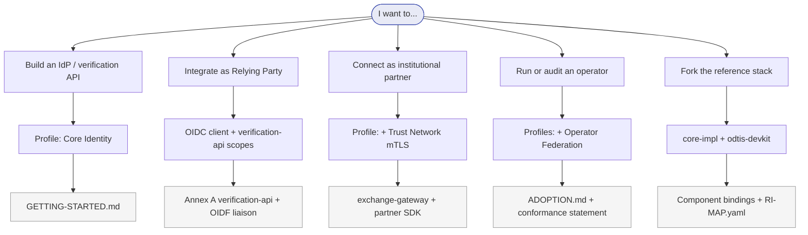
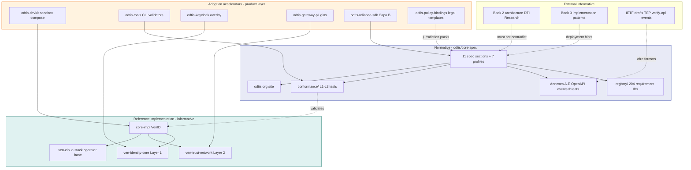
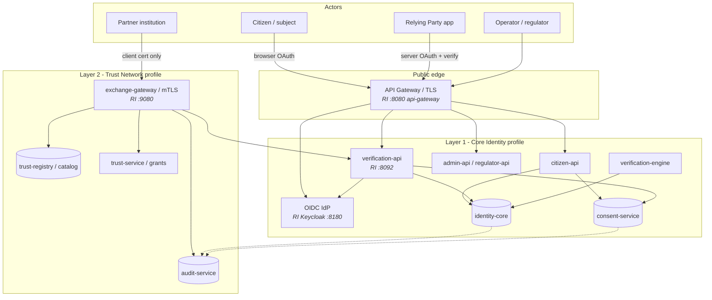
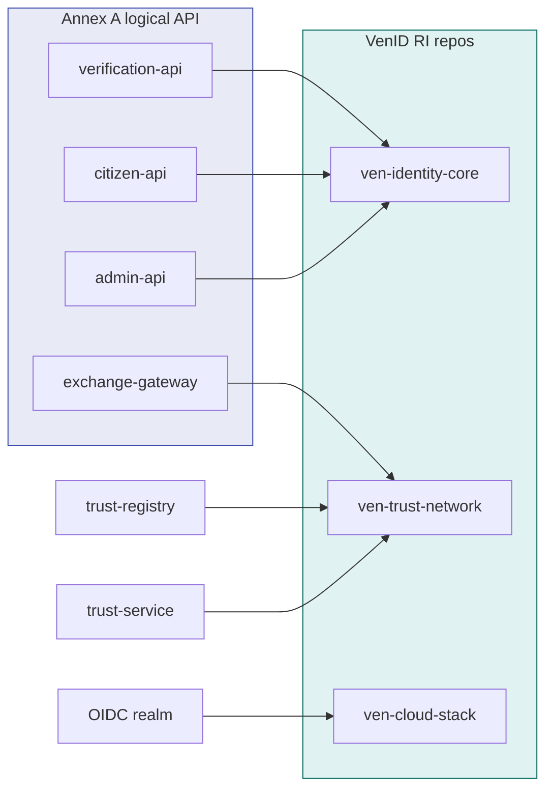
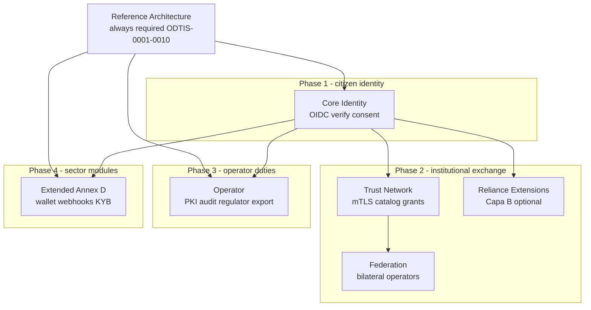
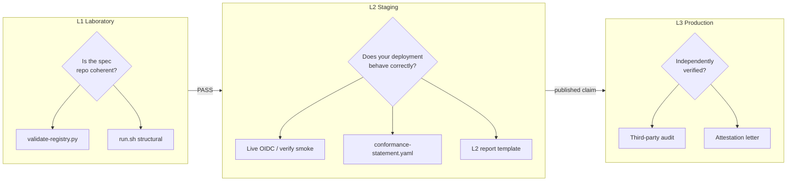
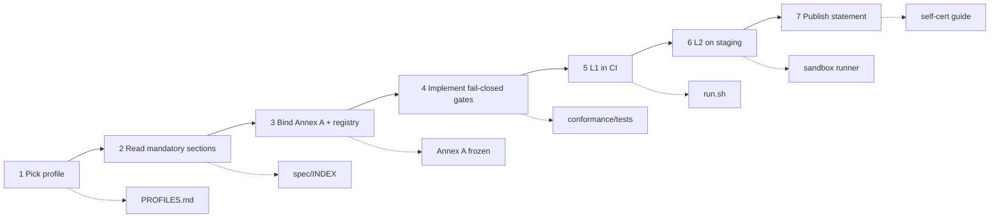
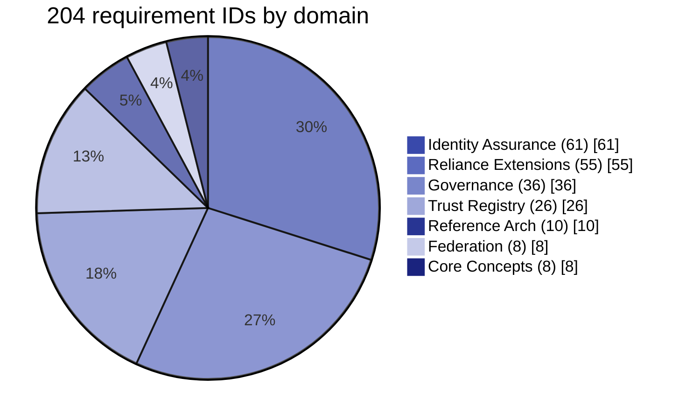
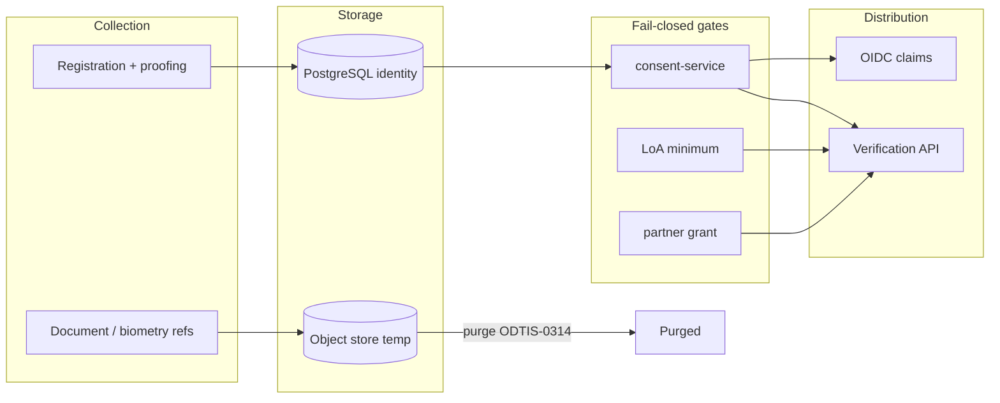

<div class="odtis-hub-hero" markdown="1">

# Visual architecture guide

**One page, engineer-first:** where ODTIS lives in repos, how the two layers talk, which profile to declare, and how to reach L1/L2/L3  - without reading 11 spec sections first.

<p class="odtis-hub-meta" markdown="1">
<strong>15-minute path:</strong> [Getting started](GETTING-STARTED.md) |
<strong>Normative text:</strong> [Specification](../spec/INDEX.md) |
<strong>RI mapping:</strong> [Component bindings](COMPONENT-BINDINGS.md) |
<strong>Academic figures:</strong> Paper P01 (PlantUML) on [digitaltrustinfrastructure.org](https://digitaltrustinfrastructure.org)
</p>

</div>

!!! tip "How to read these diagrams"
    Boxes name **logical ODTIS surfaces** (Annex A OpenAPI bundles). Ports and repo names in grey callouts are **informative** VenID bindings  - you can implement ODTIS without VenID. For mission and ecosystem narrative see [About ODTIS](ABOUT.md).

---

## Developer compass  - start here

Pick your lane. Each path links to the doc that answers the next question.



| If you are... | Read first | Then run |
|---------------|------------|----------|
| **Vendor / greenfield** | [Getting started](GETTING-STARTED.md) → [Profile comparison](PROFILES.md) | `./conformance/run.sh` (L1) |
| **RP / app team** | [OIDF positioning](../governance/liaison/OIDF-POSITIONING.md) + [verification-api OpenAPI](../annexes/A-openapi-registry/verification-api.openapi.yaml) | Sandbox OIDC against your IdP |
| **Partner backend** | [Trust Network spec](../spec/04-trust-network/SPEC.md) section 4.4 | mTLS smoke via `exchange-client` (RI) |
| **Operator / regulator** | [Operator profile](../spec/profiles/operator-profile.md) + [Section 10](../spec/10-deployment-profiles/SPEC.md) | L2 statement + [self-cert guide](../conformance/certification/self-cert-guide.md) |
| **Contributor** | [Component bindings](COMPONENT-BINDINGS.md) | Pick a component YAML + linked test |

---

## Ecosystem map  - spec, RI, and product layer

ODTIS is **normative in `core-spec`**; everything else is optional acceleration. You never need VenID to claim conformance.



**Rule of thumb:** implement against **Annex A + registry**; use RI only as a worked example. Product repos shorten time-to-first-green-test; they do not replace the spec.

---

## Two-layer stack  - trust boundaries

Two public edges, two threat models. Layer 1 = HTTPS + OIDC/JWT. Layer 2 = mTLS + partner grants only.



| Boundary | Protocol | Who | Fail-closed gate |
|----------|----------|-----|------------------|
| **L1 edge** | HTTPS, OIDC, JWT | Citizens, RPs, operators | Consent + LoA before attribute release ([ODTIS-0331](../spec/05-consent-privacy/SPEC.md)) |
| **L2 edge** | mTLS + `service_id` + purpose | Partner backends only | Grant + cert validation ([ODTIS-0224](../spec/04-trust-network/SPEC.md), [ODTIS-0535](../spec/08-security/SPEC.md)) |

Partners **never** call `citizen-api` or microservices directly  - only `exchange-gateway`.

---

## Request paths  - three flows that matter

=== "Citizen login (OIDC)"

    Standard OAuth 2.0 + PKCE. ODTIS adds consent audit and LoA claims on top of OIDC.

    ```mermaid
    sequenceDiagram
    autonumber
    participant U as Citizen browser
    participant RP as Relying Party
    participant GW as API Gateway
    participant KC as OIDC IdP
    participant CS as consent-service

    U->>RP: Open app
    RP->>GW: Authorization request + PKCE
    GW->>KC: /authorize
    KC->>U: Login + consent prompt
    U->>KC: Approve scopes
    KC->>RP: Authorization code
    RP->>KC: Token exchange
    KC-->>RP: ID token + access token
    Note over CS: consent.granted audited
    ```

    **Implementer notes:** register RP as OIDC client; request only scopes you can justify under consent policy. See [OIDF positioning](../governance/liaison/OIDF-POSITIONING.md).

=== "RP verification (server)"

    Server-to-server attribute release. **No consent → no attributes** (403, not partial leak).

    ```mermaid
    sequenceDiagram
    autonumber
    participant RP as Relying Party
    participant VA as verification-api
    participant CS as consent-service
    participant IC as identity-core

    RP->>VA: GET /users/:id/verification + scopes
    VA->>CS: Active consent for client_id?
    alt consent denied
    VA-->>RP: 403 consent_denied (no attributes)
    else consent OK + LoA sufficient
    VA->>IC: Load subject + LoA
    VA-->>RP: attributes + assurance_level
    end
    ```

    **OpenAPI:** [verification-api](../annexes/A-openapi-registry/verification-api.openapi.yaml) · **Tests:** `test_verification_consent_scope`, `test_loa_claim`

=== "Partner exchange (Layer 2)"

    Metadata-only exchange where possible ([ODTIS-0225](../spec/04-trust-network/SPEC.md)). Gateway proxies to L1 APIs after grant check.

    ```mermaid
    sequenceDiagram
    autonumber
    participant PB as Partner backend
    participant XGW as exchange-gateway
    participant TS as trust-service
    participant VA as verification-api
    participant AUD as audit-service

    PB->>XGW: mTLS + service_id + purpose
    XGW->>TS: Validate cert + grant
    alt denied
    XGW-->>PB: 403 fail-closed
    else approved
    XGW->>VA: Forward scoped request
    VA-->>XGW: Response
    XGW-->>PB: Response
    XGW->>AUD: exchange event + trace_id
    end
    ```

    **RI shortcut:** `ven-partner-sdk` / `exchange-client` in [core-impl](https://github.com/odtis/core-impl)

---

## Logical surfaces → reference code

Informative mapping only. Your stack may use different names; bind via [component-bindings YAML](../implementation/component-bindings/).



Full matrix with ODTIS IDs per component: [Component bindings](COMPONENT-BINDINGS.md) · Machine-readable: [RI-MAP.yaml](../implementation/RI-MAP.yaml)

---

## Profiles and deployment phases

Profiles are **what you claim**. Deployment phases ([Section 10](../spec/10-deployment-profiles/SPEC.md)) are **how mature** your production posture is.



| Phase | Add profile | You gain | Typical integrator |
|-------|-------------|----------|-------------------|
| **1** | Core Identity | OIDC, verification API, consent | National IdP, bank KYC hub |
| **2** | + Trust Network | mTLS gateway, catalog, grants | Telco, insurer, agency exchange |
| **2+** | + Reliance Extensions | Capa B reliance schema + sub-modules | High-assurance RP overlay |
| **2+** | + Federation | Bilateral cross-operator trust | Cross-border wallet / eID |
| **3** | + Operator | PKI ceremonies, regulator export | Platform operator |
| **4** | + Extended | Wallet, webhooks, KYB, inclusion | Sector pilots |

Details: [Profile comparison](PROFILES.md) · Declare in [conformance-statement.yaml](../conformance/templates/conformance-statement.yaml)

---

## Conformance ladder  - L1 → L2 → L3

Each level answers a different question. Do not skip L1 in CI even if you only care about production.



| Level | Question | Command / artifact | Guide |
|-------|----------|-------------------|-------|
| **L1** | Registry + tests internally consistent? | `./conformance/run.sh` | [Conformance README](../conformance/README.md) |
| **L2** | Live stack matches declared profiles? | `run-sandbox-check.sh` + statement YAML | [Self-cert guide](../conformance/certification/self-cert-guide.md) |
| **L3** | Production maturity audited? | Auditor attestation | [Auditor guide](../conformance/certification/auditor-guide.md) |

!!! warning "Trademark"
    L2 self-cert does **not** grant the **ODTIS Certified** mark. See [Trademark policy](../governance/TRADEMARK-POLICY.md).

---

## Adoption workflow  - independent vendor

End-to-end path from zero to publishable claim (typically days to weeks, not months of spec archaeology).



Expanded narrative: [Adoption guide](../ADOPTION.md) · [Getting started](GETTING-STARTED.md)

---

## Normative domains (requirement counts)

Where complexity lives in the registry  - useful when scoping a team or a sprint.



Table view: [Domain map](DOMAINS.md) | [Requirements index](REQUIREMENTS-INDEX.md)

---

## Data and trust boundaries

Personal data flows **in** through registration; flows **out** only through gates. Temp biometrics/docs purge per [ODTIS-0314](../spec/05-consent-privacy/SPEC.md).



Privacy normative section: [Section 5 Consent and privacy](../spec/05-consent-privacy/SPEC.md) · Threat controls: [Annex B](../annexes/B-threat-mitigations/README.md)

---

<div class="odtis-hub-footer" markdown="1">

## Quick links by goal

| Goal | Document |
|------|----------|
| 15-minute implementer path | [Getting started](GETTING-STARTED.md) |
| Full adoption narrative | [Adoption guide](../ADOPTION.md) |
| RI surface → ODTIS ID map | [Component bindings](COMPONENT-BINDINGS.md) |
| VenID stack diagrams (ports, compose) | [core-impl ARCHITECTURE](https://github.com/odtis/core-impl/blob/main/docs/ARCHITECTURE.md) |
| OpenAPI downloads | [Downloads & artifacts](DOWNLOADS.md) |
| Profile dependencies | [Profile comparison](PROFILES.md) |
| Threat controls | [Annex B threats](../annexes/B-threat-mitigations/README.md) |
| Live project metrics | [Status](STATUS.md) |

</div>
