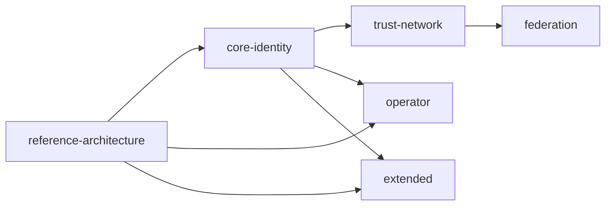

# ODTIS Reference Architecture profile

**Profile ID:** `reference-architecture`

**Depends on:** -

**ODTIS sections:** 1

---

## Purpose

Structural foundation for every ODTIS conformance claim: the **two-layer VenID model** (Layer 1 identity product, Layer 2 trust network), **profile composition rules**, **version binding**, and **conformance statement** structure.

This profile is **not** Book 2 C4 diagrams (informative). It normatively binds how implementers partition capabilities and declare what they satisfy.

**Normative scope:** section 1 - **10 registry IDs** (`ODTIS-0001` - `ODTIS-0010`).

---

## Architectural layers

| Layer | Name | Primary profiles |
|-------|------|------------------|
| **Layer 1** | Identity product | Core Identity, Extended (sub-modules) |
| **Layer 2** | Trust network | Trust Network, Federation |

Layer 1 MAY deploy without Layer 2. Layer 2 MUST NOT be claimed without Layer 1 for the same operator scope (`ODTIS-0001`).

Informative C4 and container views: [Book 2 chapter 3](https://github.com/finnectos/venezuela/blob/main/docs/sources/books/02-platform-specification-monograph/chapters/03-reference-architecture/CHAPTER.md).

---

## Profile dependency graph

Every functional profile **depends on** `reference-architecture`. An implementation MUST NOT claim Core Identity, Trust Network, Federation, Operator, or Extended without also satisfying this profile.

---

## Mandatory sections

| Section | Topic | IDs |
|---------|-------|-----|
| [section 1](../01-scope-conformance/SPEC.md) | Scope, layers, profile rules, conformance claims | `0001` - `0010` |

---

## Conformance

- Tests: [Reference Architecture](/conformance/tests/)
- L1: review conformance statement JSON/Markdown against profile dependency rules
- Required for **all** ODTIS claims (sandbox through production)

---

## Relationship to other profiles

| Profile | Reference Architecture role |
|---------|----------------------------|
| Core Identity | Layer 1 baseline; requires RA profile |
| Trust Network | Layer 2; inherits RA via Core Identity chain |
| Federation | Cross-instance Layer 2; `ODTIS-0002` |
| Operator | Cross-cutting duties; requires RA + Core Identity |
| Extended | Optional modules; `ODTIS-0006` anti-weakening rule |

---

<!-- GENERATED:profile-requirements:START -->

<!-- Generated by scripts/generate-profile-docs.py @ 0.9.0-draft -->

## Profile registry

| Field | Value |
|-------|-------|
| Profile ID | `reference-architecture` |
| Title | Reference Architecture |
| Status | draft |
| Domains | ODTIS-0000 |
| Mandatory sections | `01-scope-conformance` |
| Registry | [Profile definitions](/registry/profiles.yaml) |

## Book 1 decision domains (informative)

Mapping from Book 1 sponsor decisions to this profile. Normative text remains in ODTIS sections.

| Domain | Title | Key ODTIS IDs |
|--------|-------|---------------|
| **D1** | Institutional mandate and sponsor accountability | `ODTIS-0001`, `ODTIS-0008`, `ODTIS-0532`, `ODTIS-0534`, `ODTIS-0536` |
| **D6** | Extended module composition (no weakening) | `ODTIS-0006`, `ODTIS-0532`, `ODTIS-0533` |

Full matrix: [Book 1 domain map (YAML)](/registry/book1-domains.yaml).

## Deployment phase matrix

**ODTIS deployment phases applicable:** 0, 1, 2, 3, 4

| Phase | Name | Extended in production |
|-------|------|------------------------|
| 1 | Pilot / sandbox | forbidden |
| 2 | Production scale-up | optional |
| 3 | National / multi-region | optional |
| 4 | Full operator mandate | optional |

Cross-profile matrix: [section 10](../10-deployment-profiles/SPEC.md), [Activation (YAML)](/annexes/D-extended-profiles/activation.yaml).

## Normative requirements (ODTIS-MNNN)

**10 normative IDs** in this profile (`ODTIS-0001` - `ODTIS-0010`).

Full index: [Requirements index](/site/REQUIREMENTS-INDEX.md).

### Section 1 - Scope and conformance (10)

| ID | Legacy | Keyword | Requirement | Spec | Test |
|----|--------|---------|-------------|------|------|
| `ODTIS-0001` | `ODTIS-1.2.3` | MUST NOT | Trust Network profile MUST NOT be claimed without Core Identity profile for the same operator scope | [section 1](../../spec/01-scope-conformance/SPEC.md) | `test_layer2_requires_layer1.md` ([repo](https://github.com/odtis/core-spec/blob/main/conformance/tests/reference-architecture/test_layer2_requires_layer1.md)) |
| `ODTIS-0002` | `ODTIS-1.7.0` | MUST NOT | Federation profile MUST NOT be claimed without Trust Network profile for the same operator scope | [section 1](../../spec/01-scope-conformance/SPEC.md) | `test_federation_requires_trust_network.md` ([repo](https://github.com/odtis/core-spec/blob/main/conformance/tests/reference-architecture/test_federation_requires_trust_network.md)) |
| `ODTIS-0003` | `ODTIS-1.7.1` | MUST | Conformance claims MUST list every profile and Extended sub-module satisfied | [section 1](../../spec/01-scope-conformance/SPEC.md) | `test_profile_declaration_complete.md` ([repo](https://github.com/odtis/core-spec/blob/main/conformance/tests/reference-architecture/test_profile_declaration_complete.md)) |
| `ODTIS-0004` | `ODTIS-1.7.2` | MUST NOT | An implementation MUST NOT claim a profile unless all profiles in its depends_on chain are also claimed and satisfied | [section 1](../../spec/01-scope-conformance/SPEC.md) | `test_profile_dependency_chain.md` ([repo](https://github.com/odtis/core-spec/blob/main/conformance/tests/reference-architecture/test_profile_dependency_chain.md)) |
| `ODTIS-0005` | `ODTIS-1.7.5` | MUST | Conformance claims MUST name the ODTIS spec version against which requirements and tests were evaluated | [section 1](../../spec/01-scope-conformance/SPEC.md) | `test_version_binding.md` ([repo](https://github.com/odtis/core-spec/blob/main/conformance/tests/reference-architecture/test_version_binding.md)) |
| `ODTIS-0006` | `ODTIS-1.6.5` | MUST NOT | Extended sub-modules MUST NOT weaken Core Identity, Trust Network, or Federation requirements | [section 1](../../spec/01-scope-conformance/SPEC.md) | `test_extended_no_weakening.md` ([repo](https://github.com/odtis/core-spec/blob/main/conformance/tests/reference-architecture/test_extended_no_weakening.md)) |
| `ODTIS-0007` | `ODTIS-1.9.3` | MUST NOT | Implementations MUST NOT use prohibited ODTIS claims including ODTIS certified without statement, Full ODTIS without listing profiles, or eIDAS/QTSP equivalence from ODTIS alone | [section 1](../../spec/01-scope-conformance/SPEC.md) | `test_prohibited_claims.md` ([repo](https://github.com/odtis/core-spec/blob/main/conformance/tests/reference-architecture/test_prohibited_claims.md)) |
| `ODTIS-0008` | `ODTIS-1.9.1` | MUST | Conformance statements MUST include odtis_version, profiles, extended_modules, level, operator, scope, requirements reference, tests summary, date, and contact | [section 1](../../spec/01-scope-conformance/SPEC.md) | `test_statement_minimum_fields.md` ([repo](https://github.com/odtis/core-spec/blob/main/conformance/tests/reference-architecture/test_statement_minimum_fields.md)) |
| `ODTIS-0009` | `ODTIS-1.7.4` | MUST NOT | Implementations MUST NOT imply Trust Network, Federation, Operator, or Extended conformance when only Core Identity is declared | [section 1](../../spec/01-scope-conformance/SPEC.md) | `test_minimal_claim_no_implied_profiles.md` ([repo](https://github.com/odtis/core-spec/blob/main/conformance/tests/reference-architecture/test_minimal_claim_no_implied_profiles.md)) |
| `ODTIS-0010` | `ODTIS-1.9.2` | MUST | Implementations MUST pass all applicable conformance tests for declared profiles and level, or mark tests partial and list pending test IDs without waiving MUST requirements | [section 1](../../spec/01-scope-conformance/SPEC.md) | `test_applicable_tests_required.md` ([repo](https://github.com/odtis/core-spec/blob/main/conformance/tests/reference-architecture/test_applicable_tests_required.md)) |

## Conformance coverage

| Metric | Value |
|--------|-------|
| Requirements in profile | 10 |
| Linked tests | 10 |
| Implemented (smoke) | 1 |
| Manifest | [Conformance manifest](/conformance/profiles/reference-architecture/manifest.yaml) |

Regenerate manifests: `python3 scripts/build-conformance-manifest.py`

Related: [Section 1 - Scope and conformance](../01-scope-conformance/SPEC.md) section 1.6, [Profile comparison](/site/PROFILES.md).

<!-- GENERATED:profile-requirements:END -->
